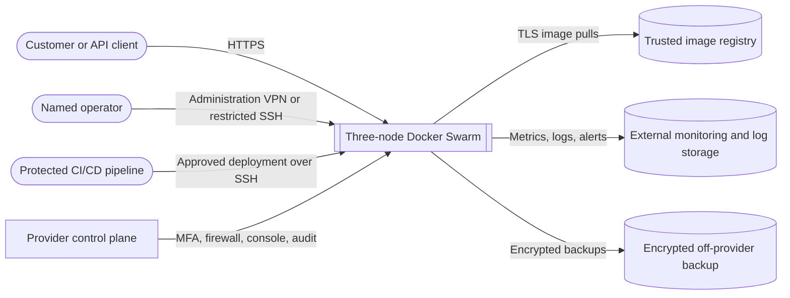
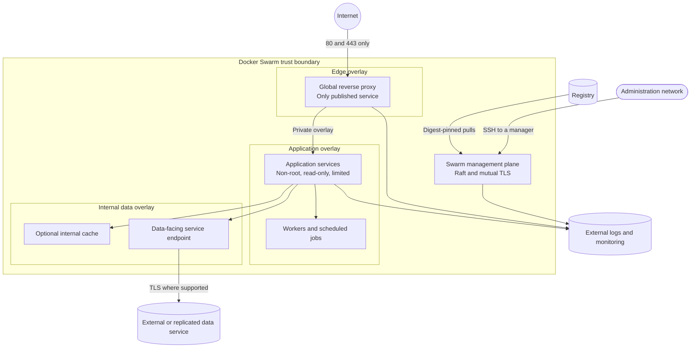
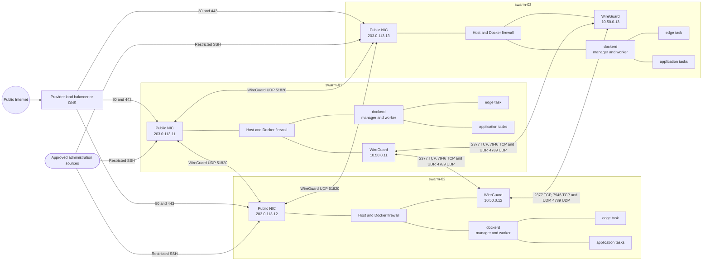
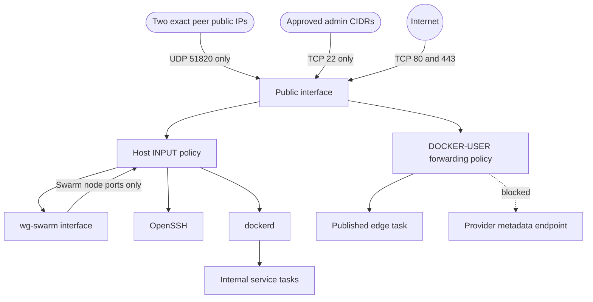
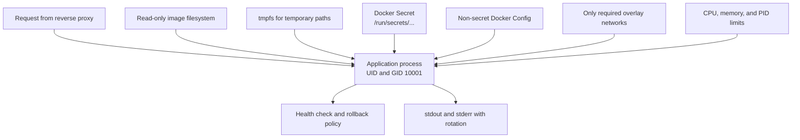

# Pragmatic Docker Swarm Hardening on Three Ubuntu 26.04 VPS Nodes

This proposal evaluates and extends the repository's reusable Docker Swarm
template; it is not a claim about an already-running customer deployment.

**Target:** a production Docker Swarm on three Ubuntu 26.04 LTS VPS nodes  
**Security posture:** business-grade, recoverable, and maintainable rather than maximalist  
**Architecture style:** C4-inspired views followed by an exact implementation sequence  
**Last reviewed:** 2026-08-13

> Replace every example address, hostname, interface name, image digest, account, and storage path before use. Test the complete build in a staging environment and keep the provider console available while changing SSH or firewall policy.

Project audit notation used in this proposal:

- [x] This repository enforces the item or an automated
  verification asserts it.
- [ ] The item is pending, conditional, externally managed, or requires a live
  operational rehearsal. Notes identify partial and not-applicable cases.

A checked repository control is not proof of current provider or live-server
state. Use `task verify PROVIDER=templ-prod` for the implemented runtime assertions,
and retain separate evidence for provider-firewall rules and operational tests.

---

## Contents

These boxes track sections reviewed in this repository audit; they are not
security-control status.

- [x] [1. Executive recommendation](#1-executive-recommendation)
- [x] [2. Scope, assumptions, and limits](#2-scope-assumptions-and-limits)
- [x] [3. Pragmatic hardening tiers](#3-pragmatic-hardening-tiers)
- [x] [4. C4-inspired architecture views](#4-c4-inspired-architecture-views)
- [x] [5. Step-by-step implementation](#5-step-by-step-implementation)
- [x] [6. Validation before go-live](#6-validation-before-go-live)
- [x] [7. Step-by-step build checklist](#7-step-by-step-build-checklist)
- [x] [8. Per-release checklist](#8-per-release-checklist)
- [x] [9. Recurring operations checklist](#9-recurring-operations-checklist)
- [x] [10. Quick audit commands](#10-quick-audit-commands)
- [x] [11. Exception policy](#11-exception-policy)
- [x] [12. Recommended final architecture](#12-recommended-final-architecture)
- [x] [13. References](#13-references)

---

## 1. Executive recommendation

For exactly three VPS nodes, run all three as **Swarm managers and workers**. This gives a three-voter Raft quorum: the cluster remains manageable after one manager is lost, but not after two. Capacity-plan the applications so the remaining two nodes can carry every critical service during maintenance or a failure.

Use this baseline:

For this project, an unchecked item still applies to template-production unless marked as
conditional or not applicable. Provider-console configuration and operational
rehearsals are not treated as complete merely because the setup guide instructs
an operator to perform them.

- [ ] **Partial — finish the `/32` addressing:** Build a **full-mesh WireGuard
  underlay** with one fixed `/32` tunnel address per node.
  - [x] template-production has stable `10.217.79.11`–`10.217.79.13` addresses, unique
    Vault-backed keys, a full mesh, and exact `/32` peer `AllowedIPs` routes.
  - [ ] Change each server interface address from its current `/24` prefix to
    `/32`, then make `task verify PROVIDER=templ-prod` assert the exact prefix.
- [x] **Completed:** Bind Swarm listen, advertise, manager, and data-path traffic
  to the WireGuard addresses, never the public addresses. `swarm-up` configures
  this and `verify` checks each manager's private address and port.
- [ ] **External verification required:** At the provider firewall, expose only
  the project's intended public entry points.
  - [ ] Keep TCP 80/443 closed until a public edge service is deliberately
    deployed; then expose only those application ports.
  - [ ] Permit the project's actual WireGuard port, UDP 51830, only from the
    controller's public `/32` and the three server public `/32` addresses.
  - [ ] Keep TCP 22 closed normally; permit it from the controller's trusted
    `/32` only during documented bootstrap or recovery.
- [ ] **External verification required:** Confirm TCP 2377, TCP/UDP 7946, and
  UDP 4789 are denied on every public interface. The repository binds Swarm to
  WireGuard and documents the provider rule, but it does not manage or inspect
  the provider firewall.
- [ ] **Implement and verify explicitly:** Keep Docker's firewall backend on
  **iptables** for Swarm. Docker currently uses its default because the
  project-owned `daemon.json` does not select a backend, and `verify` does not
  yet inspect the effective Docker firewall chains.
- [ ] **Implement the production host policy:** Use the provider firewall as
  the primary Internet perimeter and add a small, project-owned template-production host
  policy for:
  - [ ] host `INPUT` traffic;
  - [ ] Docker-published traffic through `DOCKER-USER`;
  - [ ] container access to the provider's confirmed metadata endpoints.

  The local Lima baseline has a project `INPUT` policy, but there is no
  equivalent template-production host policy and no `DOCKER-USER` or metadata policy yet.
- [ ] **Implement before publishing applications:** Publish only a global
  reverse-proxy service on TCP 80/443, preferably in host publishing mode. No
  reverse-proxy or public Swarm workload is defined yet; keep 80/443 closed
  until it is.
- [ ] **Partial — enforce the access policy:** Treat Docker access as root
  access. template-production uses the named `ops` SSH account with privilege escalation, but
  automation does not yet require an empty `docker` group or verify the final
  SSH and sudo policy.
- [ ] **Implement with the first application stack:** Require digest-pinned
  images, Docker Secrets, numeric non-root users, read-only root filesystems,
  dropped capabilities, resource and PID limits, health checks, and controlled
  rollback. The digest-pinned temporary gVisor verification job proves the
  runtime only; it is not an application workload-hardening policy.
- [ ] **Partial — rehearse restore and add application-data backups:** Encrypted
  six-hour Restic backups capture `/var/lib/docker/swarm` from the one manager
  labeled `run_on_backup=true` and retain 30 days. Application data is separate,
  and no isolated restore rehearsal is complete.
- [ ] **Partial — add a maintenance runbook:** Patch, drain, and reboot one
  manager at a time. The backup runner safely performs a temporary one-manager
  drain and restores `Active`, but there is no serial patch/reboot workflow that
  proves quorum and service health before proceeding to the next manager.
- [ ] **Complete before production go-live:** Test one-node loss, a failed
  deployment and rollback, external IPv4/IPv6 exposure, WireGuard and overlay
  MTU, and a complete isolated restore. `task verify PROVIDER=templ-prod` covers the
  current WireGuard, Docker, gVisor, and three-manager runtime baseline, but not
  these failure and recovery drills.

This guide intentionally does **not** require custom kernel lockdown, hand-written seccomp profiles for every service, mandatory boot-time disk passphrases, host intrusion agents with no response owner, or hundreds of generic benchmark settings. Those controls can be added for a demonstrated risk after testing.

---

## 2. Scope, assumptions, and limits

### 2.1 Example node plan

The example public addresses use documentation-only ranges.

| Node | Failure domain | Public IPv4 | WireGuard IPv4 | Swarm role | Workload role |
|---|---|---:|---:|---|---|
| `swarm-01` | zone-a | `203.0.113.11` | `10.50.0.11/32` | manager | worker, edge |
| `swarm-02` | zone-b | `203.0.113.12` | `10.50.0.12/32` | manager | worker, edge |
| `swarm-03` | zone-c | `203.0.113.13` | `10.50.0.13/32` | manager | worker, edge |

Example network plan:

| Purpose | Example range or port | Notes |
|---|---|---|
| WireGuard node mesh | `10.50.0.0/24` | Each peer receives one `/32` |
| Swarm overlay pool | `10.60.0.0/16` | Create `/24` overlay networks |
| Local Docker pools | `172.30.0.0/16` | Optional, divided into `/24` networks |
| Administration source | `198.51.100.0/24` | Replace with actual office/VPN CIDRs |
| WireGuard outer port | UDP 51820 | Permit only from exact peer public IPs |
| Public application | TCP 80/443 | Prefer a provider load balancer in front |

Check every range for overlap with provider networks, office networks, site VPNs, customer networks, backup networks, and future acquisitions. Changing a live cluster's overlay addressing is disruptive.

### 2.2 Assumptions

This guide assumes:

- [x] Ubuntu 26.04 LTS on all three nodes.
- [x] Fixed public addresses and stable WireGuard tunnel addresses.
- [ ] One trusted operations team, not mutually hostile tenants.
- [ ] A trusted TLS image registry.
- [ ] Stack definitions and host configuration in protected version control.
- [ ] External monitoring and off-provider backups.
- [ ] A reverse proxy or provider load balancer as the only public application entry point.
- [ ] The business can tolerate one node being unavailable.
- [ ] Stateful services have their own replication and backup design.

The first two assumptions are enforced by the template-production inventory and runtime
verification. The registry, public edge, monitoring, backup, outage-capacity,
and stateful-service assumptions are not implemented yet. The single-team
trust model and protection of the Git host require operator confirmation.

### 2.3 Threats addressed

The baseline is designed to reduce risk from:

- [ ] Internet scanning and opportunistic exploitation.
- [ ] Accidental exposure of Docker or Swarm management ports.
- [ ] A stolen SSH key, CI credential, or registry credential.
- [ ] A vulnerable application attempting host access or lateral movement.
- [ ] Excessive Linux capabilities or writable container filesystems.
- [ ] Runaway containers exhausting memory, PIDs, disk, or CPU.
- [x] Packet interception or tampering on the VPS underlay.
- [ ] Loss or compromise of one VPS.
- [ ] Operator errors during releases, upgrades, and firewall changes.
- [ ] Provider loss or ransomware when independent backups exist.

The current repository directly addresses underlay interception with
WireGuard and reduces container escape risk by making gVisor the default Docker
runtime. It does not yet claim complete coverage of any threat that depends on
the provider perimeter, application manifests, identity governance, monitoring,
backups, or rehearsed recovery.

### 2.4 Important limits

Docker Swarm has a broad manager privilege boundary. An identity that can control a manager or its Docker socket can normally obtain root-equivalent control across the cluster by scheduling a privileged task, mounting host paths, or attaching secrets.

Therefore:

- [ ] Keep manager and deployment access to a very small group.
- [ ] Treat CI/CD deployment credentials as production-root credentials.
- [ ] Do not mount `/var/run/docker.sock` into application or reverse-proxy containers.
- [ ] A read-only Docker socket mount is still dangerous: filesystem mount mode does not make Docker API operations read-only.
- [ ] Do not use one Swarm as a hard isolation boundary for hostile teams or customers.
- [ ] Use separate clusters or stronger virtualization boundaries for hostile multi-tenancy.

Swarm also does not replicate application data. A local volume remains local to one node. Three application replicas do not make an ordinary database image into a safe database cluster.

---

## 3. Pragmatic hardening tiers

### 3.1 Required baseline

| Area | Required control | Current repository status |
|---|---|---|
| Provider | Named accounts, MFA, audit logs, separate failure domains, restrictive firewall | External and unverified |
| Host | Current Ubuntu security updates, controlled reboots, time sync, AppArmor, persistent logs | Pending beyond the enforced Ubuntu release |
| SSH | Named users, key-only authentication, no direct root login, restricted source networks | Partial: named `ops` transport and pinned host keys; server SSH policy is unmanaged |
| WireGuard | Unique keys, exact `/32` peer routes, peer-IP firewalling, tested MTU | Partial: mesh and peer routes implemented; interface `/32`, provider rules, and MTU test remain |
| Docker access | No public Docker API; no routine membership in the `docker` group | Partial: managed daemon config has no TCP listener; group and live listener checks remain |
| Docker firewall | Docker-managed iptables enabled; user policy in `DOCKER-USER` | Pending for template-production |
| Swarm | Three managers, fixed WireGuard advertise/data addresses, rotated join tokens | Partial: private three-manager cluster implemented; token rotation remains |
| Network | Swarm ports only over WireGuard; small overlay networks; public edge only | Partial: private Swarm binding implemented; application overlays and edge remain |
| Workloads | Non-root, read-only root, minimal capabilities, limits, health checks, rollback | Pending the first application stack |
| Secrets | Docker Secrets or approved external delivery; never plaintext in Git or images | Partial: infrastructure keys use Ansible Vault; application secrets remain |
| Images | Trusted registry, vulnerability scanning, immutable digest in production | Partial: verification image is digest-pinned; no production release policy exists |
| Logging | Rotating local logs, off-cluster security logs, disk and inode alerts | Pending |
| Recovery | Cold Swarm-state backup, application-native backups, tested restoration | Pending |
| Operations | One-node-at-a-time maintenance and documented incident actions | Partial: backup temporarily drains and restores its labeled manager; patch, reboot, and recovery workflow remains |

### 3.2 Conditional controls

Add these when the threat model and operating model justify them:

None of these conditional controls is currently selected by the project. Leave
them unchecked until the decision, owner, recovery impact, and verification are
documented.

- [ ] **Swarm autolock:** useful against offline theft of manager key material, but every manager restart requires the unlock key.
- [ ] **WireGuard preshared keys:** optional additional symmetric protection; they add key-management work for every peer pair.
- [ ] **Custom AppArmor or seccomp profiles:** valuable for a small number of high-risk services after compatibility testing.
- [ ] **Runtime detection:** useful only when alerts are tuned and someone is accountable for response.
- [ ] **Host audit rules:** useful for recording configuration changes when logs are collected and reviewed.
- [ ] **Image signature verification:** high value when CI can enforce it consistently.
- [ ] **SSH hardware-backed keys or an SSH certificate authority:** useful when the team can operate key issuance and revocation reliably.
- [ ] **Provider load balancer, CDN, or WAF:** useful for DDoS handling, TLS policy, health checks, and public applications.
- [ ] **Application egress restrictions:** useful for tightly understood workloads; they require maintenance as dependencies change.
- [ ] **Full-disk encryption with unattended unlock:** useful only when the provider and recovery design support it without taking all managers offline after reboot.

### 3.3 Deliberately omitted from the default

Do not add these merely to satisfy a scanner. Checked items are absent from the
current repository by deliberate design; Internet-exposure items remain
unchecked because the provider perimeter is external to this repository.

- [ ] Publishing TCP 2375 or exposing the Docker API without mutual TLS and a separate review.
- [ ] Exposing TCP 2377, TCP/UDP 7946, or UDP 4789 to the Internet.
- [x] Disabling Docker-managed iptables rules.
- [x] Enabling Docker's native nftables firewall backend while the daemon is in Swarm mode.
- [x] Assuming UFW alone controls Docker-published ports.
- [x] Recursive `chmod` or `chown` under `/var/lib/docker` or `/var/lib/containerd`.
- [x] Blanket `--privileged`, host PID/IPC/network, host-root mounts, device access, or Docker-socket mounts.
- [x] Rootless Docker as this Swarm baseline; it does not provide the required overlay design.
- [x] User-namespace remapping without storage-driver and application testing.
- [x] Generic sysctl bundles that disable forwarding or break overlay networking.
- [x] Blindly disabling IPv6 while public AAAA records, provider routing, or monitoring still use it.
- [x] Blanket `noexec` mounts on temporary or application paths without testing package upgrades and workloads.
- [x] Automatic simultaneous reboots of all three managers.
- [x] A public dashboard or management agent merely for convenience.

---

## 4. C4-inspired architecture views

These diagrams describe the target architecture, not the current completion
state. In template-production, substitute `templ-prod-*`, `scwg0`, UDP 51830, and
`10.217.79.11`–`10.217.79.13`; include the macOS controller as a third peer on
each server. The host firewall, public edge, application overlays, monitoring,
and backup components shown below remain proposed.

The diagrams use Mermaid syntax supported by GitHub and many Markdown viewers.

### 4.1 Level 1 — System context



**Trust decision:** customers reach only the public edge. Named operators and the release system can reach the management plane. Registry, monitoring, and backup are authenticated dependencies.

### 4.2 Level 2 — Runtime and trust boundaries



**Network decision:** a service receives only the overlay networks it requires. Overlay membership is the primary Swarm-native segmentation control, so avoid large shared networks.

### 4.3 Level 3 — Three-VPS deployment



**Availability decision:** any one manager may be unavailable while the remaining two retain quorum. Never take two managers down together.

### 4.4 Level 4 — Node components and packet paths



**Firewall decision:** host services are controlled in `INPUT`; Docker-published traffic is controlled before Docker's own forwarding rules in `DOCKER-USER`; the provider firewall remains the first perimeter.

### 4.5 Level 4 — Hardened workload pattern



**Workload decision:** assume the image can contain a vulnerability. The service definition limits what a compromised process can write, reach, consume, or inherit.

---

## 5. Step-by-step implementation

### Step 0 — Record the design before provisioning

Create a short design record containing:

- [ ] Hostnames, public addresses, and provider failure domains.
- [ ] Public interface names after provisioning.
- [x] WireGuard addresses and UDP listening port.
- [ ] Administration IPv4 and IPv6 source CIDRs.
- [ ] Swarm overlay pool and local Docker address pool.
- [x] Every intended public TCP and UDP port. `docs/setup-templ-prod.md` records UDP
  51830, temporary recovery SSH, and closed edge ports until deployment.
- [ ] Registry, monitoring, log, DNS, and backup endpoints.
- [ ] Named operators and CI/CD identities.
- [ ] RPO and RTO for each stateful service.
- [ ] Whether Swarm autolock is enabled.
- [ ] Whether public IPv6 is supported or explicitly denied.
- [ ] Where break-glass access, backup credentials, and the autolock key are stored.
- [ ] Expected node and application capacity during a one-node outage.

The template-production inventory records the three server names, public endpoints,
WireGuard addresses, UDP 51830, and requested scheduling availability. Failure
domains, public interface and IPv6 decisions, Docker address pools, dependent
service endpoints, capacity, RPO/RTO, autolock, and break-glass custody are not
recorded yet.

Do not proceed until address overlap and public exposure are resolved on paper.

### Step 1 — Secure the provider account and place the VPS nodes

**Project status:** external and unverified. The repository does not provision
provider accounts, MFA, audit logging, failure-domain placement, console access,
or cloud firewalls.

1. Use named provider accounts, not a shared login.
2. Require phishing-resistant MFA when the provider supports it.
3. Store recovery codes outside the provider account.
4. Enable provider audit logging and retain it off-account where possible.
5. Put the three VPS nodes in distinct zones or physical hosts where the provider exposes that choice.
6. Use one supported Ubuntu 26.04 LTS image and an Infrastructure-as-Code or reproducible provisioning process.
7. Use provider disk encryption when it is transparent and does not interfere with recovery.
8. Disable or rotate unused provider API, object-storage, rescue, and snapshot credentials.
9. Do not place long-lived secrets in cloud-init user-data. Provider control planes and instance metadata may retain it.
10. Document the provider console and rescue process before applying host firewall rules.

Apply a restrictive provider firewall before the first public boot where possible. The exact rules are defined in Step 7.

### Step 2 — Provision a minimal Ubuntu 26.04 host

**Project status:** partial. The roles refuse any release other than Ubuntu
26.04 Resolute and require AMD64 for template-production, but VPS provisioning, machine-ID
uniqueness, initial patching, hostname assignment, and removal of unused
packages remain operator/provider responsibilities.

On each node:

```bash
sudo hostnamectl set-hostname swarm-01   # change per node
sudo timedatectl set-timezone UTC

sudo apt-get update
sudo DEBIAN_FRONTEND=noninteractive apt-get full-upgrade -y
sudo apt-get install -y \
  apparmor-utils \
  ca-certificates \
  chrony \
  curl \
  gnupg \
  iptables \
  iputils-ping \
  iputils-tracepath \
  jq \
  unattended-upgrades \
  wireguard-tools

sudo systemctl enable --now chrony
sudo systemctl --failed
sudo ss -lntup
```

Use the smallest provider image that remains supportable. Do not blindly remove cloud networking or provider guest agents; first determine whether they supply networking, monitoring, entropy, snapshots, or console access.

Verify that cloned images have unique identities and host keys:

```bash
cat /etc/machine-id
sudo ssh-keygen -lf /etc/ssh/ssh_host_ed25519_key.pub
```

Every node must have a different machine ID and SSH host key. If an image was cloned after those values were created, regenerate them before use.

### Step 3 — Configure updates, controlled reboots, time, and logs

**Project status:** pending. No role configures unattended security updates,
reboot policy, chrony, persistent journald, retention, or alerts.

#### 3.1 Enable automatic Ubuntu security updates

Ubuntu installs `unattended-upgrades` by default on many server images, but verify its schedule explicitly:

```bash
sudo tee /etc/apt/apt.conf.d/20auto-upgrades >/dev/null <<'EOF'
APT::Periodic::Update-Package-Lists "1";
APT::Periodic::Unattended-Upgrade "1";
APT::Periodic::AutocleanInterval "7";
EOF

sudo tee /etc/apt/apt.conf.d/52swarm-reboot-policy >/dev/null <<'EOF'
Unattended-Upgrade::Automatic-Reboot "false";
EOF

sudo systemctl enable --now apt-daily.timer apt-daily-upgrade.timer
sudo unattended-upgrade --dry-run --debug
```

Do not allow unattended reboot of manager nodes. Alert on `/var/run/reboot-required`, then use the one-node maintenance procedure in Step 20.

Docker Engine packages from Docker's repository should be upgraded through the same controlled one-node-at-a-time process. Do not hold them indefinitely and silently miss security fixes.

#### 3.2 Verify time synchronization

```bash
chronyc tracking
chronyc sources -v
timedatectl status
```

Time errors make certificate, log-correlation, and incident analysis failures harder to diagnose.

#### 3.3 Make the system journal persistent and bounded

```bash
sudo install -d -m 0755 /etc/systemd/journald.conf.d
sudo tee /etc/systemd/journald.conf.d/10-production.conf >/dev/null <<'EOF'
[Journal]
Storage=persistent
Compress=yes
SystemMaxUse=1G
RuntimeMaxUse=256M
MaxRetentionSec=30day
EOF

sudo systemctl restart systemd-journald
sudo journalctl --disk-usage
```

Tune retention to node disk size and external log collection. Local logs are a buffer, not the only copy.

### Step 4 — Harden SSH without losing recovery access

**Project status:** template-production uses a named `ops` account, a dedicated controller SSH
key, fingerprint-pinned host aliases, and public SSH only for bootstrap or
recovery. The repository does not configure or verify the servers' `sshd`
policy, account lifecycle, `docker` group membership, provider source rule, or
off-cluster audit logging, so the controls below remain open.

Create named accounts. Avoid a shared `ops` login when individual accountability is possible.

```bash
sudo groupadd --force ssh-admins
sudo adduser alice
sudo usermod -aG ssh-admins,sudo alice
```

Install independently controlled public keys in each administrator's `~/.ssh/authorized_keys`. Keep the provider console open and verify a second session before reloading SSH.

Example drop-in:

```text
# /etc/ssh/sshd_config.d/20-production.conf
PermitRootLogin no
PasswordAuthentication no
KbdInteractiveAuthentication no
PubkeyAuthentication yes
AuthenticationMethods publickey
PermitEmptyPasswords no
UsePAM yes
AllowGroups ssh-admins

MaxAuthTries 3
LoginGraceTime 30

X11Forwarding no
AllowAgentForwarding no
AllowTcpForwarding no
GatewayPorts no
PermitTunnel no

ClientAliveInterval 300
ClientAliveCountMax 2
```

Validate and reload:

```bash
sudo sshd -t
sudo systemctl reload ssh
```

Rules:

- [ ] Restrict TCP 22 at the provider firewall to approved administration CIDRs or a dedicated administration VPN.
- [ ] Keep Ubuntu's supported OpenSSH crypto policy. Do not paste a stale cipher list from an old checklist.
- [ ] Use a narrow `Match User` or `Match Group` exception if a specific operator requires port forwarding.
- [ ] Remove stale public keys promptly.
- [ ] Do not add normal operators to the `docker` group. Use `sudo docker` so access is named and logged.
- [ ] `fail2ban` is optional when SSH remains broadly reachable. It is not a substitute for source restriction and key-only login.

Review access:

```bash
getent group ssh-admins
getent group sudo
getent group docker || true
sudo journalctl -u ssh --since '24 hours ago' --no-pager
```

### Step 5 — Apply a small Ubuntu host baseline

**Project status:** pending except for project-owned directory permissions. The
repository does not reconcile AppArmor, sysctls, host services, crash dumps, or
swap. Do not assume cloud-image defaults satisfy these checks.

#### 5.1 Keep AppArmor enforcing

Ubuntu enables AppArmor by default. Verify it rather than replacing it with an untested policy set:

```bash
sudo aa-status
cat /sys/module/apparmor/parameters/enabled
```

Docker should use its generated `docker-default` profile unless a service has a tested custom profile. Do not disable AppArmor to make a broken image work.

#### 5.2 Apply only low-risk sysctl settings

Create a small file that does not disable forwarding or interfere with Docker bridges and overlays:

```bash
sudo tee /etc/sysctl.d/60-swarm-host.conf >/dev/null <<'EOF'
# Reduce accidental kernel information disclosure.
kernel.kptr_restrict = 2
kernel.dmesg_restrict = 1
kernel.yama.ptrace_scope = 1

# Protect common shared-directory link and file attacks.
fs.protected_hardlinks = 1
fs.protected_symlinks = 1
fs.protected_fifos = 2
fs.protected_regular = 2

# Reject redirects and source-routed packets on routed server interfaces.
net.ipv4.conf.all.accept_redirects = 0
net.ipv4.conf.default.accept_redirects = 0
net.ipv4.conf.all.send_redirects = 0
net.ipv4.conf.default.send_redirects = 0
net.ipv4.conf.all.accept_source_route = 0
net.ipv4.conf.default.accept_source_route = 0
net.ipv6.conf.all.accept_redirects = 0
net.ipv6.conf.default.accept_redirects = 0
net.ipv6.conf.all.accept_source_route = 0
net.ipv6.conf.default.accept_source_route = 0

# Basic protection for SYN floods.
net.ipv4.tcp_syncookies = 1
EOF

sudo sysctl --system
```

Do **not** set `net.ipv4.ip_forward=0`; Docker requires forwarding. Do not apply strict reverse-path filtering, unprivileged-user-namespace changes, broad BPF restrictions, or a generic networking bundle without staging tests.

#### 5.3 Review services and listeners

```bash
sudo systemctl list-unit-files --state=enabled
sudo systemctl --type=service --state=running
sudo ss -lntup
```

Disable only services proven unnecessary. Typical minimal nodes do not need a local mail server, print service, multicast discovery, desktop environment, or database listener, but do not remove a provider agent merely because its name is unfamiliar.

#### 5.4 Protect sensitive paths without recursive permission changes

```bash
sudo install -d -o root -g root -m 0700 /etc/wireguard
sudo install -d -o root -g root -m 0755 /etc/docker
sudo stat -c '%U:%G %a %n' /etc/wireguard /etc/docker
```

After Docker and Swarm are initialized, verify `/var/lib/docker/swarm` is root-protected. Docker Engine 29 may also keep image content in `/var/lib/containerd`; monitor and back up the correct paths for the installed configuration. Never recursively rewrite ownership or modes inside either data directory.

#### 5.5 Decide how to handle crash dumps and swap

Kernel and process crash dumps can contain credentials, application data, and secret material from memory. Ubuntu 26.04 may enable kernel crash-dump support on server installations, so record an explicit decision rather than leaving it unnoticed:

```bash
systemctl is-enabled kdump-tools 2>/dev/null || true
systemctl is-active kdump-tools 2>/dev/null || true
coredumpctl list --no-pager 2>/dev/null | head || true
```

Keep crash dumps only when the team uses them, storage is access-controlled and encrypted, retention is bounded, and disk capacity is monitored. Otherwise disable the unused kernel crash-dump service:

```bash
sudo systemctl disable --now kdump-tools 2>/dev/null || true
```

Do not disable swap merely to satisfy a checklist. Size it deliberately, monitor swapping, and protect it with the same storage-encryption assumptions as the root disk. A host that thrashes or exhausts memory still needs workload limits and alerts.

### Step 6 — Build the full-mesh WireGuard underlay

**Project status:** substantially implemented. template-production generates and validates
Vault-backed key pairs, renders a full server mesh plus the controller, uses
exact `/32` peer routes, enables `scwg0`, and proves mesh SSH. Server interface
addresses still use `/24`, server peers set `PersistentKeepalive = 25`, and no
handshake-age, ICMP, or MTU assertion exists.

This design uses a node-only mesh. Administrator devices should normally use a separate administration VPN or approved source CIDRs rather than becoming peers in the Swarm underlay.

#### 6.1 Generate a unique key pair on each node

```bash
sudo install -d -o root -g root -m 0700 /etc/wireguard
sudo sh -c 'umask 077; \
  wg genkey > /etc/wireguard/wg-swarm.key; \
  wg pubkey < /etc/wireguard/wg-swarm.key > /etc/wireguard/wg-swarm.pub'

sudo chmod 0600 /etc/wireguard/wg-swarm.key
sudo chmod 0644 /etc/wireguard/wg-swarm.pub
sudo cat /etc/wireguard/wg-swarm.pub
```

Exchange only the public keys through an authenticated channel. Keep each private key on its node or in an approved secrets system.

#### 6.2 Use exact peer routes

The peer matrix is:

| Local node | Peer endpoint | Peer tunnel route |
|---|---|---|
| `swarm-01` | `203.0.113.12:51820` | `10.50.0.12/32` |
| `swarm-01` | `203.0.113.13:51820` | `10.50.0.13/32` |
| `swarm-02` | `203.0.113.11:51820` | `10.50.0.11/32` |
| `swarm-02` | `203.0.113.13:51820` | `10.50.0.13/32` |
| `swarm-03` | `203.0.113.11:51820` | `10.50.0.11/32` |
| `swarm-03` | `203.0.113.12:51820` | `10.50.0.12/32` |

Do not assign the same broad `10.50.0.0/24` `AllowedIPs` route to multiple peers. A `/32` per peer is both the route and the WireGuard source-address authorization.

#### 6.3 Configure `swarm-01`

```ini
# /etc/wireguard/wg-swarm.conf
[Interface]
Address = 10.50.0.11/32
ListenPort = 51820
MTU = 1420
PostUp = wg set %i private-key /etc/wireguard/%i.key

[Peer]
# swarm-02
PublicKey = REPLACE_WITH_SWARM_02_PUBLIC_KEY
Endpoint = 203.0.113.12:51820
AllowedIPs = 10.50.0.12/32

[Peer]
# swarm-03
PublicKey = REPLACE_WITH_SWARM_03_PUBLIC_KEY
Endpoint = 203.0.113.13:51820
AllowedIPs = 10.50.0.13/32
```

#### 6.4 Configure `swarm-02`

```ini
# /etc/wireguard/wg-swarm.conf
[Interface]
Address = 10.50.0.12/32
ListenPort = 51820
MTU = 1420
PostUp = wg set %i private-key /etc/wireguard/%i.key

[Peer]
# swarm-01
PublicKey = REPLACE_WITH_SWARM_01_PUBLIC_KEY
Endpoint = 203.0.113.11:51820
AllowedIPs = 10.50.0.11/32

[Peer]
# swarm-03
PublicKey = REPLACE_WITH_SWARM_03_PUBLIC_KEY
Endpoint = 203.0.113.13:51820
AllowedIPs = 10.50.0.13/32
```

#### 6.5 Configure `swarm-03`

```ini
# /etc/wireguard/wg-swarm.conf
[Interface]
Address = 10.50.0.13/32
ListenPort = 51820
MTU = 1420
PostUp = wg set %i private-key /etc/wireguard/%i.key

[Peer]
# swarm-01
PublicKey = REPLACE_WITH_SWARM_01_PUBLIC_KEY
Endpoint = 203.0.113.11:51820
AllowedIPs = 10.50.0.11/32

[Peer]
# swarm-02
PublicKey = REPLACE_WITH_SWARM_02_PUBLIC_KEY
Endpoint = 203.0.113.12:51820
AllowedIPs = 10.50.0.12/32
```

Protect and start the interface:

```bash
sudo chown root:root /etc/wireguard/wg-swarm.conf
sudo chmod 0600 /etc/wireguard/wg-swarm.conf
sudo systemctl enable --now wg-quick@wg-swarm
sudo systemctl is-active wg-quick@wg-swarm
sudo wg show wg-swarm
ip -brief address show wg-swarm
```

The `PostUp` method keeps the private key out of the peer configuration. The configuration file should still be root-only because a preshared key, if later added, is secret.

`PersistentKeepalive` is normally unnecessary when every VPS has a stable public endpoint. Add `PersistentKeepalive = 25` only to a peer behind NAT or a stateful firewall that drops idle mappings.

#### 6.6 Validate routes, handshakes, and path MTU

From each node, test the other two:

```bash
ip route get 10.50.0.12
ping -c 3 10.50.0.12
ping -c 3 10.50.0.13
sudo wg show wg-swarm latest-handshakes
```

The example assumes a 1500-byte public path and sets WireGuard MTU to 1420. Validate it rather than assuming:

```bash
# 1392-byte payload + 28 bytes IPv4/ICMP header = 1420.
ping -M do -s 1392 -c 3 10.50.0.12
tracepath 10.50.0.12
```

If this fails, lower the WireGuard MTU on all nodes and retest. Keep ICMP and ICMPv6 available; blocking them breaks path-MTU discovery and makes failures intermittent.

### Step 7 — Apply the provider firewall

**Project status:** documented but externally managed and unverified. template-production uses
UDP 51830, not the generic UDP 51820 examples below; TCP 22 is intended only for
temporary bootstrap/recovery, and TCP 80/443 stays closed until an edge exists.

With WireGuard as the underlay, raw Swarm ports do not need to be allowed by the provider firewall at all.

#### 7.1 Recommended inbound provider rules

| Destination | Protocol/port | Source | Purpose |
|---|---|---|---|
| Each VPS | UDP 51820 | The other two exact VPS public IPs | WireGuard node mesh |
| Each VPS | TCP 22 | Approved administration CIDRs or admin VPN | SSH administration |
| Edge VPS nodes | TCP 80, 443 | Internet or provider load-balancer ranges | Public application |
| Edge VPS nodes | UDP 443 | Internet or load balancer, only if HTTP/3 is used | Optional public application |
| Any VPS | TCP 2375, 2376 | Never by default | Docker API |
| Any VPS | TCP 2377 | Deny publicly | Swarm management travels inside WireGuard |
| Any VPS | TCP/UDP 7946 | Deny publicly | Swarm discovery travels inside WireGuard |
| Any VPS | UDP 4789 | Deny publicly | Overlay VXLAN travels inside WireGuard |
| Any VPS | All other inbound | Deny | Default deny |

Apply the same intent to public IPv6. When IPv6 is not supported for the application, publish no AAAA records and deny unsolicited inbound IPv6 at the provider firewall. Do not assume IPv6 is absent merely because IPv4 works.

The simplest dual-stack business design is often to terminate public IPv6 at the provider load balancer and forward to the edge nodes over the approved backend path. Direct container publication over IPv6 requires an explicit Docker IPv6 design and end-to-end testing; it is not enabled merely by adding an AAAA record.

Prefer exact peer public IPs for UDP 51820. A broad `0.0.0.0/0` WireGuard rule is unnecessary for fixed VPS peers.

### Step 8 — Install Docker Engine from the official repository

**Project status:** implemented by a different, stricter mechanism than the
generic commands below. `swarm-up` installs exact architecture-specific
Docker CE, CLI, and containerd `.deb` artifacts from Docker's Ubuntu 26.04
repository, verifies their SHA256 values and installed versions, and holds the
packages. It does not add a mutable APT repository.

Remove conflicting packages only when installed:

```bash
for pkg in docker.io docker-compose docker-compose-v2 docker-doc docker-buildx podman-docker containerd runc; do
  sudo apt-get remove -y "$pkg" 2>/dev/null || true
done
```

Configure Docker's signed apt repository:

```bash
sudo install -m 0755 -d /etc/apt/keyrings
sudo curl -fsSL https://download.docker.com/linux/ubuntu/gpg \
  -o /etc/apt/keyrings/docker.asc
sudo chmod a+r /etc/apt/keyrings/docker.asc

. /etc/os-release
sudo tee /etc/apt/sources.list.d/docker.sources >/dev/null <<EOF
Types: deb
URIs: https://download.docker.com/linux/ubuntu
Suites: ${VERSION_CODENAME}
Components: stable
Signed-By: /etc/apt/keyrings/docker.asc
EOF

sudo apt-get update
apt-cache madison docker-ce
```

Select one approved Engine version and install the same version on all three nodes. Example using the current repository candidate:

```bash
sudo apt-get install -y \
  docker-ce \
  docker-ce-cli \
  containerd.io \
  docker-buildx-plugin \
  docker-compose-plugin

sudo docker version
sudo docker info
```

For stricter change control, set `VERSION_STRING` to the exact package version shown by `apt-cache madison` and install `docker-ce="$VERSION_STRING"` and `docker-ce-cli="$VERSION_STRING"`. Keep an upgrade process; do not leave an old version pinned forever.

Do not use a convenience install script in production automation. Do not install Docker Desktop on these servers.

### Step 9 — Configure Docker and require WireGuard before startup

**Project status:** partial. The exact project-owned `daemon.json` configures
SHA512-pinned gVisor as the default runtime and adds no TCP listener. Docker is
not explicitly configured for the iptables backend, rotating local logs,
`no-new-privileges`, custom address pools, or systemd ordering after `scwg0`.

#### 9.1 Docker daemon baseline

```json
{
  "firewall-backend": "iptables",
  "iptables": true,
  "ip6tables": true,
  "no-new-privileges": true,
  "log-driver": "local",
  "log-opts": {
    "max-size": "20m",
    "max-file": "5"
  },
  "log-level": "info",
  "default-address-pools": [
    {
      "base": "172.30.0.0/16",
      "size": 24
    }
  ]
}
```

Install as `/etc/docker/daemon.json`:

```bash
sudo chown root:root /etc/docker/daemon.json
sudo chmod 0644 /etc/docker/daemon.json
sudo dockerd --validate --config-file=/etc/docker/daemon.json
```

Important decisions:

- [ ] Keep Docker's iptables management enabled. Turning it off usually breaks bridge and overlay networking.
- [ ] Keep `firewall-backend` set to `iptables` for Swarm. Ubuntu's `iptables` command may use the nftables kernel compatibility backend; that is supported and is not the same as Docker's native nftables backend.
- [ ] Keep Docker's default seccomp profile and Ubuntu AppArmor integration.
- [ ] Test `no-new-privileges` with legacy images that depend on setuid/setgid behavior.
- [ ] Use the rotating `local` log driver to prevent unbounded container logs.
- [ ] Choose non-overlapping default address pools.
- [x] Do not add TCP daemon listeners. The project-owned `daemon.json` contains
  only the pinned gVisor runtime configuration and is checked exactly by
  `verify`; add a separate live socket check before treating provider exposure
  as proven.

#### 9.2 Require the WireGuard interface before Docker

```bash
sudo systemctl edit docker
```

Add:

```ini
[Unit]
Requires=wg-quick@wg-swarm.service
After=network-online.target wg-quick@wg-swarm.service
```

Then:

```bash
sudo systemctl daemon-reload
sudo systemctl restart docker
sudo systemctl is-active wg-quick@wg-swarm docker
sudo docker info --format 'Logging={{.LoggingDriver}} Security={{json .SecurityOptions}}'
```

This prevents Docker from starting before the fixed Swarm addresses exist. The WireGuard interface can be up even when a remote peer is temporarily unreachable, so a peer outage does not itself prevent Docker startup.

#### 9.3 Confirm no remote Docker API exists

```bash
sudo ss -lntp | grep -E ':(2375|2376)\b' || true
sudo systemctl cat docker
```

Expected result: no TCP 2375 or 2376 listener.

### Step 10 — Install the host and Docker forwarding firewall

**Project status:** pending for template-production. The Lima-only nftables `INPUT` policy is
not a production host policy and does not supply `DOCKER-USER` or provider
metadata filtering. None of the example `SWARM-*` chains below exists by virtue
of the current template-production automation.

The provider firewall is the primary perimeter. The host policy is defense in depth and protects against provider-rule mistakes, unexpected Docker port publication, and container access to provider metadata.

Do not assume UFW will filter Docker-published ports. Docker performs address translation and forwarding before the normal UFW path. This sample uses `iptables` and `DOCKER-USER`; do not run a competing host-firewall manager that flushes or replaces the same chains.

#### 10.1 Create a per-node variables file

Example for `swarm-01`:

```bash
sudo tee /etc/default/swarm-firewall >/dev/null <<'EOF'
# Adapt interface names from: ip -brief link
PUBLIC_IF="ens3"
WG_IF="wg-swarm"
WG_PORT="51820"

# Exact public addresses of the other two WireGuard peers.
WG_PEER_PUBLIC_V4="203.0.113.12 203.0.113.13"
WG_PEER_PUBLIC_V6=""

# Exact tunnel addresses of the other two peers.
WG_PEER_V4="10.50.0.12 10.50.0.13"

# Space-separated administration source networks.
ADMIN_V4="198.51.100.0/24"
ADMIN_V6=""

# Interfaces from which unsolicited forwarded traffic is untrusted.
UNTRUSTED_IFS="ens3"

# Explicitly enable only when the edge supports HTTP/3.
ALLOW_HTTP3="no"

# Change for providers that use a different metadata address.
METADATA_V4="169.254.169.254/32"
METADATA_V6=""
EOF

sudo chown root:root /etc/default/swarm-firewall
sudo chmod 0600 /etc/default/swarm-firewall
```

Use the correct peer lists on `swarm-02` and `swarm-03`.

#### 10.2 Install an idempotent firewall script

```bash
sudo tee /usr/local/sbin/swarm-firewall >/dev/null <<'EOF'
#!/usr/bin/env bash
set -euo pipefail

source /etc/default/swarm-firewall

IPT=/usr/sbin/iptables
IP6T=/usr/sbin/ip6tables

ipt()   { "$IPT" -w 5 "$@"; }
ip6t()  { "$IP6T" -w 5 "$@"; }

ensure_chain() {
  local tool="$1" chain="$2"
  "$tool" -w 5 -N "$chain" 2>/dev/null || true
  "$tool" -w 5 -F "$chain"
}

replace_jump() {
  local tool="$1" parent="$2" child="$3"
  while "$tool" -w 5 -C "$parent" -j "$child" 2>/dev/null; do
    "$tool" -w 5 -D "$parent" -j "$child"
  done
  "$tool" -w 5 -I "$parent" 1 -j "$child"
}

# -----------------------------
# IPv4 host INPUT policy
# -----------------------------
ensure_chain "$IPT" SWARM-HOST-IN
replace_jump "$IPT" INPUT SWARM-HOST-IN

ipt -A SWARM-HOST-IN -i lo -j ACCEPT
ipt -A SWARM-HOST-IN -m conntrack --ctstate ESTABLISHED,RELATED -j ACCEPT
ipt -A SWARM-HOST-IN -p icmp -j ACCEPT

# DHCP client replies; harmless on statically addressed hosts.
ipt -A SWARM-HOST-IN -p udp --sport 67 --dport 68 -j ACCEPT

for src in $WG_PEER_PUBLIC_V4; do
  ipt -A SWARM-HOST-IN -i "$PUBLIC_IF" -s "$src" \
    -p udp --dport "$WG_PORT" -j ACCEPT
done

for src in $ADMIN_V4; do
  ipt -A SWARM-HOST-IN -i "$PUBLIC_IF" -s "$src" \
    -p tcp --dport 22 -m conntrack --ctstate NEW -j ACCEPT
done

for src in $WG_PEER_V4; do
  ipt -A SWARM-HOST-IN -i "$WG_IF" -s "$src" \
    -p tcp --dport 2377 -j ACCEPT
  ipt -A SWARM-HOST-IN -i "$WG_IF" -s "$src" \
    -p tcp --dport 7946 -j ACCEPT
  ipt -A SWARM-HOST-IN -i "$WG_IF" -s "$src" \
    -p udp --dport 7946 -j ACCEPT
  ipt -A SWARM-HOST-IN -i "$WG_IF" -s "$src" \
    -p udp --dport 4789 -j ACCEPT
  ipt -A SWARM-HOST-IN -i "$WG_IF" -s "$src" \
    -p icmp -j ACCEPT
done

# Reject all other traffic arriving through the node mesh or host interfaces.
ipt -A SWARM-HOST-IN -i "$WG_IF" -j DROP
ipt -A SWARM-HOST-IN -j DROP

# -----------------------------
# IPv4 Docker forwarding policy
# -----------------------------
if ipt -nL DOCKER-USER >/dev/null 2>&1; then
  ensure_chain "$IPT" SWARM-DOCKER
  replace_jump "$IPT" DOCKER-USER SWARM-DOCKER

  # Block containers from reaching common provider metadata by forwarding.
  if [[ -n "${METADATA_V4:-}" ]]; then
    ipt -A SWARM-DOCKER -d "$METADATA_V4" -j DROP
  fi

  ipt -A SWARM-DOCKER -m conntrack --ctstate ESTABLISHED,RELATED -j RETURN

  for iface in $UNTRUSTED_IFS; do
    # Match the original destination port before Docker DNAT.
    ipt -A SWARM-DOCKER -i "$iface" -p tcp \
      -m conntrack --ctstate NEW --ctorigdstport 80 -j RETURN
    ipt -A SWARM-DOCKER -i "$iface" -p tcp \
      -m conntrack --ctstate NEW --ctorigdstport 443 -j RETURN

    if [[ "$ALLOW_HTTP3" == "yes" ]]; then
      ipt -A SWARM-DOCKER -i "$iface" -p udp \
        -m conntrack --ctstate NEW --ctorigdstport 443 -j RETURN
    fi

    # Drop any other new public forwarding, including accidental port publication.
    ipt -A SWARM-DOCKER -i "$iface" \
      -m conntrack --ctstate NEW -j DROP
  done

  ipt -A SWARM-DOCKER -j RETURN
fi

# -----------------------------
# IPv6 host and Docker policy
# -----------------------------
if [[ -x "$IP6T" ]]; then
  ensure_chain "$IP6T" SWARM6-HOST-IN
  replace_jump "$IP6T" INPUT SWARM6-HOST-IN

  ip6t -A SWARM6-HOST-IN -i lo -j ACCEPT
  ip6t -A SWARM6-HOST-IN -m conntrack --ctstate ESTABLISHED,RELATED -j ACCEPT
  ip6t -A SWARM6-HOST-IN -p ipv6-icmp -j ACCEPT
  ip6t -A SWARM6-HOST-IN -p udp --sport 547 --dport 546 -j ACCEPT

  for src in $WG_PEER_PUBLIC_V6; do
    ip6t -A SWARM6-HOST-IN -i "$PUBLIC_IF" -s "$src" \
      -p udp --dport "$WG_PORT" -j ACCEPT
  done

  for src in $ADMIN_V6; do
    ip6t -A SWARM6-HOST-IN -i "$PUBLIC_IF" -s "$src" \
      -p tcp --dport 22 -m conntrack --ctstate NEW -j ACCEPT
  done

  ip6t -A SWARM6-HOST-IN -j DROP

  if ip6t -nL DOCKER-USER >/dev/null 2>&1; then
    ensure_chain "$IP6T" SWARM6-DOCKER
    replace_jump "$IP6T" DOCKER-USER SWARM6-DOCKER

    if [[ -n "${METADATA_V6:-}" ]]; then
      ip6t -A SWARM6-DOCKER -d "$METADATA_V6" -j DROP
    fi

    ip6t -A SWARM6-DOCKER -m conntrack --ctstate ESTABLISHED,RELATED -j RETURN

    for iface in $UNTRUSTED_IFS; do
      ip6t -A SWARM6-DOCKER -i "$iface" -p tcp \
        -m conntrack --ctstate NEW --ctorigdstport 80 -j RETURN
      ip6t -A SWARM6-DOCKER -i "$iface" -p tcp \
        -m conntrack --ctstate NEW --ctorigdstport 443 -j RETURN

      if [[ "$ALLOW_HTTP3" == "yes" ]]; then
        ip6t -A SWARM6-DOCKER -i "$iface" -p udp \
          -m conntrack --ctstate NEW --ctorigdstport 443 -j RETURN
      fi

      ip6t -A SWARM6-DOCKER -i "$iface" \
        -m conntrack --ctstate NEW -j DROP
    done

    ip6t -A SWARM6-DOCKER -j RETURN
  fi
fi
EOF

sudo chown root:root /usr/local/sbin/swarm-firewall
sudo chmod 0750 /usr/local/sbin/swarm-firewall
sudo bash -n /usr/local/sbin/swarm-firewall
```

The script intentionally leaves outbound traffic and Docker's own forwarding machinery intact. It owns only dedicated chains and inserts them before the normal host or Docker forwarding rules.

#### 10.3 Run the policy as a systemd service

```bash
sudo tee /etc/systemd/system/swarm-firewall.service >/dev/null <<'EOF'
[Unit]
Description=Host and Docker Swarm firewall policy
Wants=network-online.target
Requires=wg-quick@wg-swarm.service docker.service
After=network-online.target wg-quick@wg-swarm.service docker.service
PartOf=docker.service

[Service]
Type=oneshot
ExecStart=/usr/local/sbin/swarm-firewall
RemainAfterExit=yes

[Install]
WantedBy=multi-user.target
EOF
```

Before enabling it, save the current rules and keep a provider console open:

```bash
sudo iptables-save  > /root/iptables-before-swarm.rules
sudo ip6tables-save > /root/ip6tables-before-swarm.rules

sudo systemctl daemon-reload
sudo systemctl enable --now swarm-firewall.service
sudo systemctl status --no-pager swarm-firewall.service
```

Open a new SSH session before closing the existing one. Roll back from the provider console when necessary:

```bash
sudo iptables-restore  < /root/iptables-before-swarm.rules
sudo ip6tables-restore < /root/ip6tables-before-swarm.rules
```

Do not persist a full `iptables-save` snapshot containing Docker's dynamic chains. Keep the custom script as the declarative source of policy and allow Docker to recreate its own rules.

#### 10.4 Inspect the active policy

```bash
sudo iptables -S SWARM-HOST-IN
sudo iptables -S DOCKER-USER
sudo iptables -S SWARM-DOCKER
sudo ip6tables -S SWARM6-HOST-IN
sudo ip6tables -S DOCKER-USER 2>/dev/null || true
```

The original-destination conntrack match adds some processing cost. This baseline uses it for only the few intended public ports. The provider firewall should still block unintended ports first.

### Step 11 — Initialize the three-manager Swarm over WireGuard

On `swarm-01`:

```bash
sudo docker swarm init \
  --listen-addr 10.50.0.11:2377 \
  --advertise-addr 10.50.0.11:2377 \
  --data-path-addr 10.50.0.11 \
  --default-addr-pool 10.60.0.0/16 \
  --default-addr-pool-mask-length 24
```

Obtain the manager join token through the protected administration session:

```bash
sudo docker swarm join-token -q manager
```

On `swarm-02`:

```bash
read -rsp 'Manager join token: ' SWARM_TOKEN; echo
sudo docker swarm join \
  --token "$SWARM_TOKEN" \
  --listen-addr 10.50.0.12:2377 \
  --advertise-addr 10.50.0.12:2377 \
  --data-path-addr 10.50.0.12 \
  10.50.0.11:2377
unset SWARM_TOKEN
```

Repeat on `swarm-03` with `10.50.0.13`.

Verify from a manager:

```bash
sudo docker node ls
sudo docker info --format \
  'Swarm={{.Swarm.LocalNodeState}} Control={{.Swarm.ControlAvailable}} Managers={{.Swarm.Managers}} Nodes={{.Swarm.Nodes}}'
```

Expected state:

- [x] Three nodes are `Ready`.
- [x] All three have manager status.
- [x] One is leader and two are reachable.
- [x] Every node advertises its WireGuard address.

`swarm-up` creates or reconciles this state, and
`task verify PROVIDER=templ-prod` asserts the same cluster ID, three exact inventory
node IDs, readiness, manager reachability, exactly one leader, private manager
addresses, all-`active` availability, and exactly one `run_on_backup=true` node.

Rotate bootstrap tokens immediately after all nodes join:

```bash
sudo docker swarm join-token --rotate manager
sudo docker swarm join-token --rotate worker
```

Do not leave tokens in Git, tickets, shell transcripts, or ordinary CI variables.

Add operational labels:

```bash
sudo docker node update --label-add zone=zone-a --label-add edge=true swarm-01
sudo docker node update --label-add zone=zone-b --label-add edge=true swarm-02
sudo docker node update --label-add zone=zone-c --label-add edge=true swarm-03
```

Labels influence scheduling; they are not a security boundary because a manager can change them.

### Step 12 — Decide on Swarm autolock

**Project status:** no autolock decision or unlock-key workflow is implemented.
Do not enable it until all four operational prerequisites below are satisfied.

Swarm encrypts sensitive Raft data on disk. Autolock adds protection for manager key material after a daemon restart, but the manager cannot resume until an operator supplies the unlock key.

Enable autolock when:

- [ ] offline theft or snapshot exposure of a manager disk is a material threat;
- [ ] on-call operators can retrieve the key after every reboot;
- [ ] the procedure has been rehearsed one manager at a time;
- [ ] the key is stored independently of the cluster and backups.

```bash
sudo docker swarm update --autolock=true
sudo docker swarm unlock-key
```

Rehearse one manager at a time:

```bash
sudo systemctl restart docker
sudo docker swarm unlock
```

Leave autolock disabled when unattended provider reboots must recover automatically and the team cannot reliably supply the key. Record the decision either way.

### Step 13 — Create purpose-specific overlay networks with a tested MTU

**Project status:** pending the first application stack. No project overlay
pool, overlay network, trust-zone split, or overlay MTU is configured or tested.

WireGuard already encrypts the node underlay, so Docker overlay encryption is not enabled by default. Double encryption adds overhead and complicates MTU calculation without protecting against a compromised host.

The example WireGuard MTU is 1420. VXLAN adds approximately another 50 bytes, so use an overlay MTU of 1370 as a conservative starting point:

```bash
sudo docker network create \
  --driver overlay \
  --subnet 10.60.10.0/24 \
  --opt com.docker.network.driver.mtu=1370 \
  edge_internal

sudo docker network create \
  --driver overlay \
  --subnet 10.60.20.0/24 \
  --opt com.docker.network.driver.mtu=1370 \
  app_internal

sudo docker network create \
  --driver overlay \
  --subnet 10.60.30.0/24 \
  --internal \
  --opt com.docker.network.driver.mtu=1370 \
  data_internal
```

Rules:

1. Use `/24` overlay networks unless scale testing demonstrates a different need.
2. Do not create one cluster-wide application network.
3. Do not use `--attachable` unless a documented diagnostic or migration workflow requires standalone containers.
4. Attach the reverse proxy only to the edge-facing application networks it needs.
5. Keep databases, caches, and brokers on narrow internal networks.
6. A multi-homed service can bridge its attached networks when compromised; attach only what is required.
7. Keep application TLS for sensitive protocols when it is supported cleanly.
8. Do not enable Docker overlay encryption by default on top of WireGuard.

Test the 1370-byte overlay path from representative tasks. A 1342-byte ICMP payload plus IPv4 and ICMP headers equals 1370:

```bash
# Run inside an approved diagnostic task attached to the overlay.
ping -M do -s 1342 -c 3 PEER_TASK_IP
```

If the provider path MTU is below 1500, lower the WireGuard and overlay MTUs consistently and retest. Symptoms of an incorrect MTU include small requests working while TLS handshakes, image responses, database queries, or large packets stall.

This design uses host-mode published ports and does not rely on the routing mesh. If a future service uses ingress publishing, recreate the `ingress` network with the validated MTU **before** production services use it:

```bash
# Only while no services depend on the current ingress network.
sudo docker network rm ingress
sudo docker network create \
  --driver overlay \
  --ingress \
  --subnet 10.60.250.0/24 \
  --gateway 10.60.250.1 \
  --opt com.docker.network.driver.mtu=1370 \
  ingress
```

### Step 14 — Publish only a global edge proxy

**Project status:** not applicable to the current infrastructure-only baseline.
No reverse proxy or public Swarm service is defined, so TCP 80/443 should remain
closed at the provider firewall.

Use one edge task per node and host-mode publishing. A provider load balancer or DNS sends traffic only to healthy nodes. This avoids making every application port part of the routing mesh.

Illustrative stack fragment:

```yaml
version: "3.9"

services:
  edge:
    image: registry.example.com/platform/edge@sha256:REPLACE_WITH_VERIFIED_DIGEST
    user: "10001:10001"
    read_only: true
    init: true

    tmpfs:
      - /tmp:size=64m,mode=1777
      - /run:size=16m,mode=0755

    cap_drop:
      - ALL

    configs:
      - source: edge_routes_v1
        target: /etc/edge/routes.yml
        uid: "10001"
        gid: "10001"
        mode: 0444

    ports:
      - target: 8080
        published: 80
        protocol: tcp
        mode: host
      - target: 8443
        published: 443
        protocol: tcp
        mode: host

    networks:
      - edge_internal

    healthcheck:
      test: ["CMD", "/usr/local/bin/healthcheck"]
      interval: 30s
      timeout: 5s
      retries: 3
      start_period: 15s

    deploy:
      mode: global
      placement:
        constraints:
          - node.labels.edge == true
      resources:
        reservations:
          cpus: "0.10"
          memory: 64M
        limits:
          cpus: "1.00"
          memory: 512M
          pids: 200
      restart_policy:
        condition: on-failure
        delay: 5s
        max_attempts: 5
        window: 120s
      update_config:
        parallelism: 1
        order: stop-first
        failure_action: rollback
        monitor: 30s

networks:
  edge_internal:
    external: true

configs:
  edge_routes_v1:
    external: true
```

Operational rules:

- [ ] Let the container listen on unprivileged ports such as 8080/8443 and map host 80/443. Do not add `NET_BIND_SERVICE` merely to listen on container port 80.
- [ ] Use `stop-first` for a global host-mode service because two tasks cannot bind the same host port during a start-first update.
- [ ] Do not mount the Docker socket for route discovery. Prefer reviewed static configuration delivered with Docker Configs or a control process outside the workload boundary.
- [ ] Do not publish internal application, database, cache, broker, metrics, or management ports.
- [ ] Put dashboards behind the administration network and strong authentication, or do not deploy them.
- [ ] Choose one certificate model: provider-managed TLS, DNS-01 ACME, or an explicitly designed certificate distribution process.
- [ ] If HTTP/3 is enabled, publish UDP 443 and update both provider and host policies intentionally.

### Step 15 — Use a hardened application service template

**Project status:** pending the first application stack. The default gVisor
runtime adds a sandbox boundary, but it does not satisfy the non-root,
read-only, capability, resource, secret, health-check, or rollback controls
below.

```yaml
version: "3.9"

services:
  app:
    image: registry.example.com/acme/app@sha256:REPLACE_WITH_VERIFIED_DIGEST
    user: "10001:10001"
    read_only: true
    init: true
    stop_grace_period: 30s

    tmpfs:
      - /tmp:size=64m,mode=1777
      - /run:size=16m,mode=0755

    cap_drop:
      - ALL

    environment:
      DB_PASSWORD_FILE: /run/secrets/db_password

    configs:
      - source: app_config_v1
        target: /app/config.yml
        uid: "10001"
        gid: "10001"
        mode: 0444

    secrets:
      - source: app_db_password_v1
        target: db_password
        uid: "10001"
        gid: "10001"
        mode: 0400

    networks:
      - edge_internal
      - data_internal

    healthcheck:
      test: ["CMD", "/app/healthcheck"]
      interval: 30s
      timeout: 5s
      retries: 3
      start_period: 20s

    deploy:
      replicas: 3
      placement:
        preferences:
          - spread: node.labels.zone

      resources:
        reservations:
          cpus: "0.25"
          memory: 128M
        limits:
          cpus: "1.00"
          memory: 512M
          pids: 200

      restart_policy:
        condition: on-failure
        delay: 5s
        max_attempts: 5
        window: 120s

      update_config:
        parallelism: 1
        order: start-first
        failure_action: rollback
        monitor: 30s

      rollback_config:
        parallelism: 1
        order: stop-first
        failure_action: pause
        monitor: 30s

networks:
  edge_internal:
    external: true
  data_internal:
    external: true

configs:
  app_config_v1:
    external: true

secrets:
  app_db_password_v1:
    external: true
```

For every service, answer these questions before approval:

- [ ] Can it run as a non-root numeric UID/GID?
- [ ] Can the root filesystem be read-only?
- [ ] Which exact paths must be writable, and can they use `tmpfs` or a narrow named volume?
- [ ] Can all capabilities be dropped? If not, which single capability is required and why?
- [ ] Is the default seccomp and AppArmor policy active?
- [ ] What CPU, memory, and PID limits prevent node-wide failure?
- [ ] Do reservations fit when one node is unavailable and during a start-first rollout?
- [ ] Is the health check an application check rather than merely a process-exists check?
- [ ] Does rollback work with the database and schema version?
- [ ] Does the service need every attached network?
- [ ] Does it publish any port that should remain private?
- [ ] Does it mount any host path, device, or runtime socket?
- [ ] Does it receive only the secrets it needs?

`docker stack deploy` uses the Swarm stack format and does not accept every option from newer local Compose workflows. Render and inspect the actual deployed service rather than assuming an option was enforced:

```bash
sudo docker stack config -c stack.yml >/dev/null
sudo docker stack deploy -c stack.yml --with-registry-auth acme
sudo docker stack services acme
sudo docker service inspect --pretty acme_app
```

Use `--with-registry-auth` only when workers need the deployer's registry credentials. Use a least-privilege, read-only registry identity.

Reject by default:

- [ ] `privileged: true`;
- [ ] host PID, IPC, or network mode;
- [ ] Docker or containerd socket mounts;
- [ ] host root or broad host-directory mounts;
- [ ] broad capability additions;
- [ ] device and kernel-module access;
- [ ] writable image root without a demonstrated need;
- [ ] secrets in environment values, labels, or image layers;
- [ ] direct publication of an internal service.

### Step 16 — Separate secrets from non-secret configuration

**Project status:** partial at the infrastructure layer only. template-production WireGuard
keys and Garage credentials use encrypted Ansible Vault state; no application
Docker Secrets or Configs exist yet.

Create a secret without putting its value in shell history:

```bash
read -rsp 'Database password: ' SECRET_VALUE; echo
printf '%s' "$SECRET_VALUE" | sudo docker secret create app_db_password_v1 -
unset SECRET_VALUE
```

Create non-secret configuration separately:

```bash
sudo docker config create app_config_v1 ./config.yml
```

Rules:

1. Never commit secret values to Git, stack YAML, `.env` files, image layers, labels, or command arguments.
2. Prefer application `*_FILE` settings and read `/run/secrets/<name>`.
3. Use Docker Configs only for non-secret data.
4. Use versioned secret and config names because they are immutable.
5. Give each service only the secrets it uses.
6. Avoid logging complete environments or secret files.
7. Remember that a malicious manager can schedule a task that mounts a Swarm secret.

Secret rotation sequence:

1. Create `app_db_password_v2`.
2. Configure the upstream system to accept the new value, with overlap when supported.
3. Update the stack to mount `v2`.
4. Deploy with rollback enabled.
5. Verify authentication, error rate, and task health.
6. Remove `v1` from every service.
7. Remove the old secret only after no task uses it:

```bash
sudo docker secret rm app_db_password_v1
```

Rotate application and registry secrets after any manager compromise.

### Step 17 — Secure the image and release supply chain

**Project status:** pending for production releases. The temporary gVisor test
image is digest-pinned, but there is no application build, registry, scanning,
signing, approval, or release-record workflow.

Minimum production policy:

1. Build images in a controlled CI environment, not on production managers.
2. Use maintained, minimal base images.
3. Use multi-stage builds so compilers, package caches, and build credentials are absent from the final image.
4. Scan the final image, including OS and language dependencies.
5. Use a documented severity and exploitability policy with time-limited exceptions.
6. Declare and test a numeric non-root runtime UID/GID.
7. Push over TLS using a least-privilege robot identity.
8. Deploy an immutable digest, never `latest` and not only a mutable tag.
9. Retain the source revision, image digest, scan result, and release approval together.
10. Generate an SBOM and provenance record when the build platform supports them.
11. Optionally verify image signatures in CI before deployment.
12. Protect the CI deploy credential as a production-root credential.

A wrapper around `docker stack deploy` does not make arbitrary deployment access safe. A malicious service definition can turn deployment permission into host control. Require review of stack changes and restrict who can approve production releases.

### Step 18 — Design stateful services separately

**Project status:** not applicable until a stateful application is selected.
Garage is currently a local development backup target, not the template-production
application-state or Swarm-state backup design.

Swarm control-plane availability is not application-data availability.

Choose one model for each stateful service:

#### Preferred for a small operations team

Use a managed or external data service with its own authentication, TLS, availability, backups, and restore guarantees.

#### Self-hosted replicated data service

Use the database's native replication or consensus mechanism, one replica per failure domain, documented quorum behavior, and database-native backups. Test failover and split-brain behavior. Do not assume a Swarm replica count provides data replication.

#### Accepted single-node state

Pin the service to a labeled node, accept the RTO, back it up frequently, and document restoration on another node. This can be a valid business decision for lower-criticality systems, but it is not high availability.

For every volume or host path:

- [ ] Use a narrow named volume or specific directory, never a broad root mount.
- [ ] Root-own the parent and grant only the required service UID/GID access.
- [ ] Back up with application-consistent tooling.
- [ ] Test restore to another node.
- [ ] Monitor capacity, inode use, latency, and I/O errors.
- [ ] Document what happens when the task moves to a different node.

### Step 19 — Centralize monitoring and logs

**Project status:** pending. `swarm-status`, `wg-status`, and `verify` are
operator-invoked diagnostics, not continuous monitoring, alerting, centralized
logging, or retention.

The rotating Docker `local` log driver protects node disks. Add an external collection path appropriate to the application. Avoid giving a log or monitoring agent the Docker socket unless the root-equivalent risk is explicitly accepted.

Monitor from outside the Swarm failure domain where practical. Alert on:

- [ ] A node not `Ready`.
- [ ] A manager not reachable or fewer than three managers.
- [ ] Service desired/running replica mismatch.
- [ ] Repeated task restarts, rejected tasks, or rollback.
- [ ] Docker or containerd daemon failure.
- [ ] Stale or missing WireGuard handshakes.
- [ ] WireGuard packet loss and MTU symptoms.
- [ ] Unexpected changes to provider or host firewall policy.
- [ ] Host CPU saturation, memory pressure, OOM kills, PID pressure, disk space, inode exhaustion, and I/O errors.
- [ ] Capacity of `/var/lib/docker`, `/var/lib/containerd`, application data, and journals.
- [ ] TLS certificate expiry.
- [ ] Failed SSH logins and unexpected provider-console access.
- [ ] Critical image or OS vulnerabilities.
- [ ] `/var/run/reboot-required` persisting beyond the maintenance window.
- [ ] Backup failure, stale backups, and restore-test failure.
- [ ] Unexpected published ports.

Retain these records:

- [ ] Provider control-plane audit logs.
- [ ] SSH and `sudo` logs.
- [ ] WireGuard interface state and key-change records.
- [ ] Docker and containerd journals.
- [ ] Firewall deployment and change records.
- [ ] Reverse-proxy access and error logs, with privacy and retention controls.
- [ ] Application security and authentication events.
- [ ] CI build, approval, image digest, and deployment records.
- [ ] Backup and restore logs.

### Step 20 — Back up Swarm state and application data

**Project status:** pending. The fresh-controller instructions preserve the
control workstation's repository, SSH key, Vault pair, inventory, and
`known_hosts`; that is distinct from backing up `/var/lib/docker/swarm` and
application data. No cold-copy, off-provider transfer, schedule, or restore
rehearsal is implemented.

#### 20.1 Backup inventory

| Asset | Method | Suggested trigger |
|---|---|---|
| Swarm manager state | Cold copy of `/var/lib/docker/swarm` from one manager | Regularly and after topology/security changes |
| Application databases | Database-native consistent backup | According to application RPO |
| File or object data | Snapshot or application-aware copy | According to application RPO |
| Stack definitions | Protected Git repository | Every approved change |
| Registry images | Retention or replication policy | Every release |
| Provider, DNS, and firewall config | IaC or version-controlled export | Every change |
| WireGuard configuration and public-key map | Protected configuration repository | Every change |
| WireGuard private keys | Independent secrets backup or documented regeneration | At creation and rotation |
| Autolock key | Independent secret store and break-glass copy | Whenever rotated |

A Swarm-state backup contains manager keys and encrypted secret material. Encrypt it, restrict access, and keep at least one copy outside the VPS provider.

#### 20.2 Cold-copy Swarm state while retaining quorum

Run on one manager at a time, for example `swarm-03`:

```bash
# From an active manager:
sudo docker node update --availability drain swarm-03
sudo docker node ps swarm-03

# On swarm-03:
sudo systemctl stop docker
sudo tar --xattrs --acls \
  -C /var/lib/docker \
  -czf /secure-backup-path/swarm-state-$(date -u +%Y%m%dT%H%M%SZ).tar.gz \
  swarm
sudo systemctl start docker

# Required only when autolock is enabled:
sudo docker swarm unlock

# From an active manager after swarm-03 is Ready:
sudo docker node update --availability active swarm-03
sudo docker node ls
```

Encrypt and transfer the archive to the off-provider target. Do not stop a second manager until all three are healthy again.

A live filesystem copy of Raft state is not the preferred backup. Provider disk snapshots are an additional layer, not a replacement for a cold Swarm-state backup and application-consistent data backups.

#### 20.3 Restore rehearsal

At least quarterly, restore in an isolated environment:

1. Provision a compatible Ubuntu and Docker Engine host.
2. Confirm it cannot reach production networks, registries with write access, or production data services.
3. Stop Docker.
4. Restore the backed-up `swarm` directory under `/var/lib/docker` with metadata preserved.
5. Start Docker and unlock it when autolock is enabled.
6. For irrecoverable former quorum, use `docker swarm init --force-new-cluster` on the selected recovery manager.
7. Rotate the autolock key.
8. Rotate manager and worker join tokens.
9. Join replacement managers until three are present.
10. Restore application data independently.
11. Validate services, secrets, networks, image digests, published ports, and monitoring.
12. Record actual recovery time and data-loss window against RTO and RPO.

`--force-new-cluster` is a disaster-recovery action, not routine quorum repair.

### Step 21 — Patch and reboot one manager at a time

**Project status:** partial. The cold-backup runner temporarily drains only the
`run_on_backup=true` manager and restores it to `Active`, while `verify` checks
manager topology. There is no serial patch/reboot task, service-health gate, or
tested one-node maintenance runbook, so the per-run checks below must not be
pre-checked.

For `swarm-01`:

```bash
# From another manager:
sudo docker node update --availability drain swarm-01
sudo docker node ps swarm-01
sudo docker service ls

# On swarm-01:
sudo apt-get update
sudo apt-get full-upgrade -y
sudo reboot

# After reconnecting:
sudo systemctl is-active wg-quick@wg-swarm docker swarm-firewall
sudo wg show wg-swarm

# Required only when autolock is enabled:
sudo docker swarm unlock

# From an active manager:
sudo docker node ls
sudo docker node update --availability active swarm-01
sudo docker service ls
```

Before touching the next node, verify:

- [ ] all three nodes are `Ready`;
- [ ] the leader and two reachable managers are present;
- [ ] WireGuard handshakes are current;
- [ ] services have the desired replicas;
- [ ] edge health checks pass;
- [ ] no unexpected rollback or restart loop occurred;
- [ ] the external application check passes.

Use the same sequence for Docker Engine upgrades. Never upgrade or reboot two managers in parallel.

### Step 22 — Prepare incident runbooks

**Project status:** the scenarios below are proposal material, not implemented
or rehearsed runbooks. The existing safe controller disconnect and template-production reset
procedures do not cover manager compromise, key rotation, quorum recovery, or
firewall rollback.

#### 22.1 Compromised operator or CI identity

1. Disable the identity in the provider, administration VPN, SSH key or certificate system, registry, and CI platform.
2. Review provider, SSH, `sudo`, registry, and deployment records.
3. Compare deployed digests and stack definitions with approved releases.
4. Rotate registry and application credentials reachable by the identity.
5. Rebuild affected hosts if host control may have been obtained.
6. Review firewall and DNS changes.

#### 22.2 Compromised manager

Treat a compromised manager as cluster control-plane compromise:

1. Isolate the VPS at the provider firewall without immediately destroying useful evidence.
2. Keep the two healthy managers online to retain quorum.
3. Drain, demote, and remove the compromised node from a healthy manager when possible.
4. Remove or replace the compromised WireGuard public key on both healthy peers.
5. Rotate manager and worker join tokens.
6. Rotate the Swarm CA when manager key material may have been exposed.
7. Rotate application secrets, registry credentials, TLS keys, and backup credentials available to the manager.
8. Rebuild the VPS from a clean image; do not clean and rejoin it.
9. Generate a new WireGuard key pair.
10. Rejoin as a manager with the current token.
11. Restore three-manager health and validate every service.

Relevant commands, used only after checking current cluster state:

```bash
sudo docker node update --availability drain swarm-03
sudo docker node demote swarm-03
sudo docker node rm --force swarm-03
sudo docker swarm join-token --rotate manager
sudo docker swarm join-token --rotate worker
sudo docker swarm ca --rotate
```

CA rotation affects the whole cluster. Rehearse it and consult the current Docker documentation before an emergency.

#### 22.3 WireGuard private-key exposure

1. Drain the affected node.
2. Generate a new private/public key pair on that node.
3. Replace its public key in both peer configurations.
4. Restart or synchronize one peer at a time and verify the remaining two managers retain connectivity.
5. Bring up the affected interface with the new key.
6. Verify all three pairwise handshakes and MTU tests.
7. Return the node to `active` only after Swarm health is normal.
8. Revoke the old key from configuration and secrets backups.

#### 22.4 Lost manager quorum

1. Try to recover one former manager first.
2. Confirm the incident is not a WireGuard, MTU, routing, or firewall partition.
3. Restore the most current manager state only when former quorum is irrecoverable.
4. Use `--force-new-cluster` only on the selected recovery manager.
5. Add two fresh managers.
6. Rotate tokens, keys, and secrets appropriate to the cause.
7. Validate application data separately.

#### 22.5 Firewall lockout

1. Use the provider console, not repeated public SSH retries.
2. Compare `/etc/default/swarm-firewall` with documented node addresses and interfaces.
3. Restore the pre-change iptables snapshots or stop the custom service temporarily.
4. Keep the provider firewall restrictive while correcting the host policy.
5. Run `bash -n`, apply the script manually, and test a second SSH session before re-enabling the service.

---

## 6. Validation before go-live

**Project status:** none of the complete go-live tests in this section has been
automated or recorded as rehearsed. `task verify PROVIDER=templ-prod` covers the
implemented runtime baseline only: exact platform/package pins, server
WireGuard presence and peer count, gVisor configuration and execution, and the
three-manager private Swarm topology. It does not replace the external,
failure, MTU, application-policy, rollback, or restore tests below.

### 6.1 External exposure test

From a host outside the provider and administration networks:

```bash
nmap -Pn -sS -p 22,80,443,2375,2376,2377,7946 \
  203.0.113.11 203.0.113.12 203.0.113.13

sudo nmap -Pn -sU -p 443,4789,51830,7946 \
  203.0.113.11 203.0.113.12 203.0.113.13
```

Expected:

- [ ] TCP 80/443 open only where intended.
- [ ] TCP 22 unavailable from unapproved sources.
- [ ] TCP 2375, 2376, 2377, and 7946 unavailable publicly.
- [ ] UDP 4789 and 7946 unavailable publicly.
- [ ] UDP 51830 unavailable from arbitrary sources because only exact peer public IPs are allowed.
- [ ] UDP 443 open only when HTTP/3 is deliberately enabled.

Repeat for every public IPv6 address. Test from both approved and unapproved administration sources.

### 6.2 Node-mesh test

On each node:

```bash
sudo wg show scwg0
ip route get 10.217.79.12
ping -M do -s 1392 -c 3 10.217.79.12
sudo ss -lntup | grep -E ':(22|2377|4789|51830|7946)\b'
```

Use another server's `10.217.79.x` address on each node.

Confirm:

- [x] exactly two server peers plus the macOS controller peer exist;
- [x] every peer route is an exact `/32`;
- [ ] handshakes are current;
- [x] no public interface is used as the Swarm advertise or data-path address;
- [ ] the validated MTU works in both directions.

The checked topology is rendered by the template-production roles; `verify` checks the three
peer count and private Swarm addresses. It does not yet inspect each live
`AllowedIPs` value or handshake age, so the live route and handshake commands
remain part of the go-live evidence.

### 6.3 Host and Docker firewall test

```bash
sudo iptables -S SWARM-HOST-IN
sudo iptables -S DOCKER-USER
sudo iptables -S SWARM-DOCKER
sudo ip6tables -S SWARM6-HOST-IN
sudo systemctl status --no-pager swarm-firewall
```

Create a temporary staging-only service that publishes an unapproved high port. Confirm it remains unreachable from the Internet because `SWARM-DOCKER` drops new public forwarding. Remove the test service immediately.

Confirm a representative container cannot reach the provider metadata address. Use the provider's actual metadata endpoint in the test.

### 6.4 Quorum and one-node-loss test

1. Confirm three reachable managers.
2. Drain and shut down one node.
3. Confirm deployments and service updates remain manageable.
4. Confirm public traffic remains healthy through the other two nodes.
5. Restart and, if required, unlock the node.
6. Confirm WireGuard and firewall services are healthy before Docker rejoins.
7. Confirm all three managers are reachable before testing another node.

### 6.5 Overlay and MTU test

1. Place diagnostic tasks on different nodes on each overlay.
2. Test the validated overlay packet size with the don't-fragment option.
3. Transfer a larger TLS response or file between tasks.
4. Confirm services on different overlays cannot connect unless they share a network.
5. Confirm `data_internal` has no unintended external path.
6. Confirm no overlay is attachable without a documented need.

### 6.6 Workload-confinement test

For a representative application task, verify:

- [ ] the process UID is non-root;
- [ ] creating a file in an arbitrary image path fails;
- [ ] writes to intended `tmpfs` or volume paths succeed;
- [ ] the service cannot connect to networks it was not given;
- [ ] the secret appears only at the intended `/run/secrets` path;
- [ ] CPU, memory, and PID limits appear in the deployed service specification;
- [ ] the Docker and containerd sockets are absent;
- [ ] host root and broad host directories are absent;
- [ ] the default seccomp and AppArmor protections remain active.

### 6.7 Failed-deployment and rollback test

1. Deploy a deliberately failing health check in staging.
2. Confirm the rollout stops or rolls back according to policy.
3. Confirm the previous digest remains available.
4. Confirm the alert reaches the responsible person.
5. Test the documented manual rollback command.
6. Confirm database/schema changes are compatible with rollback.

### 6.8 Backup and restore test

1. Restore Swarm state into an isolated environment.
2. Restore a representative database and file volume.
3. Start the stack with pinned digests.
4. Run application integrity checks.
5. Record recovery time and data-loss window.
6. Remove any step that depends on undocumented personal knowledge.

---

## 7. Step-by-step build checklist

### 7.1 Design and provider

- [x] Three Ubuntu 26.04 LTS VPS nodes are provisioned and asserted by
  `verify`.
- [ ] Nodes are in distinct provider failure domains where available.
- [ ] Public IPv4, public IPv6, interface names, hostnames, and zones are documented.
- [x] WireGuard addresses are fixed in inventory and peer public keys are
  retained in the encrypted template-production Vault.
- [ ] Overlay and local Docker pools do not overlap with other networks.
- [ ] Provider accounts are named and protected with MFA.
- [ ] Provider audit logs are enabled and retained.
- [ ] Recovery codes and break-glass access are stored independently.
- [ ] Provider console access has been tested.
- [ ] Provider firewall rules cover both IPv4 and IPv6.
- [ ] UDP 51830 is limited to the controller and exact server peer public IPs.
- [ ] TCP 22 is limited to approved administration sources.
- [ ] Only intended edge nodes receive TCP 80/443.
- [ ] UDP 443 is closed unless HTTP/3 is intentionally used.
- [ ] TCP 2375, 2376, 2377, and 7946 are denied publicly.
- [ ] UDP 4789 and 7946 are denied publicly.
- [ ] No secret value is stored in provider user-data.

The remaining items in this subsection require provider-console or operator
evidence. This repository neither provisions the VPSes nor manages the provider
firewall. For this project, substitute UDP 51830 for the guide's generic UDP
51820 example.

### 7.2 Ubuntu host

- [ ] Every node has a unique machine ID and SSH host key.
- [ ] All security updates were installed before joining the cluster.
- [ ] Automatic package-list and security-update timers are enabled.
- [ ] Automatic reboot is disabled.
- [ ] Reboot-required state is monitored.
- [ ] Docker Engine upgrades use controlled maintenance.
- [ ] Chrony is enabled and synchronized.
- [ ] The system timezone is UTC.
- [ ] Journald is persistent and bounded.
- [ ] AppArmor is enabled and enforcing.
- [ ] Kernel and process crash-dump retention has an explicit security decision.
- [ ] Swap is sized, monitored, and covered by the storage-protection decision.
- [ ] The small sysctl file applies without errors.
- [ ] IP forwarding was not disabled.
- [ ] Running services and listening ports were reviewed.
- [ ] Unused network services were disabled deliberately.
- [x] `/etc/wireguard` is created root-owned with mode `0700`; the private
  interface configuration is mode `0600`.
- [x] `/etc/docker` and the project-owned `daemon.json` are root-owned.
- [x] The repository applies no recursive permission changes to Docker or
  containerd storage.
- [ ] Disk, inode, memory, PID, and I/O monitoring is configured.

Ubuntu 26.04 and architecture are enforced, but this project has no general
host-hardening role for upgrades, reboots, chrony, journald, AppArmor, sysctl,
swap, service review, or monitoring. Those items remain open even if the VPS
image currently supplies acceptable defaults.

### 7.3 SSH and administrator access

The repository verifies the configured ED25519 host fingerprint before public
bootstrap and normally connects as `ops` through WireGuard. It does not manage
server accounts or `sshd_config`, inspect the `docker` group, or export SSH and
sudo logs, so no item below is treated as complete from repository evidence
alone.

- [ ] Every human operator has a named account.
- [ ] Administrator keys are independently controlled.
- [ ] A second SSH session was tested before reloading configuration.
- [ ] Direct root SSH login is disabled.
- [ ] Password and keyboard-interactive authentication are disabled.
- [ ] Public-key authentication is required.
- [ ] Only the approved administration group can log in.
- [ ] X11, agent forwarding, TCP forwarding, and tunnels are disabled by default.
- [ ] Any forwarding exception is narrow and documented.
- [ ] SSH is restricted at the provider firewall or administration VPN.
- [ ] Stale accounts and keys were removed.
- [ ] The `docker` group is empty or has an approved exception.
- [ ] Operators use `sudo docker`.
- [ ] SSH and sudo logs are collected off-cluster.

### 7.4 WireGuard

- [x] Every node receives a separately generated Vault-backed WireGuard key
  pair.
- [x] Private server configurations are mode `0600` and root-owned.
- [x] Each server receives only its own private key and the peers' public keys.
- [x] Each server has exactly two server peers plus the macOS controller peer.
- [x] Every peer `AllowedIPs` entry is one exact `/32`.
- [x] Server-peer endpoints use the fixed public addresses from inventory.
- [ ] `PersistentKeepalive` is omitted unless NAT or idle timeout requires it.
- [x] The `scwg0` WireGuard interface is enabled and starts at boot.
- [ ] Pairwise routes and pings work in both directions.
- [ ] Current handshakes exist for all pairs.
- [ ] The selected WireGuard MTU passes a don't-fragment test.
- [ ] ICMP and ICMPv6 needed for path-MTU discovery are permitted.
- [ ] The WireGuard public-key map is backed up.
- [x] Private-key backup and regeneration/reset procedures are documented in
  `docs/setup-templ-prod.md`.
- [ ] A WireGuard key-rotation rehearsal has been completed.

`wg-up` proves controller-to-server and server-to-server mesh SSH, but it does
not prove ICMP, handshake freshness, or path MTU. The server interface itself
still uses a `/24` prefix; the executive checklist tracks the proposed `/32`
change and exact-prefix assertion separately. `PersistentKeepalive = 25` is
currently set on server-to-server peers, so the omission control remains open
until that choice is justified or removed.

### 7.5 Docker Engine and host firewall

- [x] Docker is installed from exact SHA256-pinned artifacts in Docker's
  official Ubuntu 26.04 repository.
- [x] All three nodes run the same approved Engine version.
- [ ] No Docker API listener exists on TCP 2375 or 2376.
- [x] `/etc/docker/daemon.json` validates successfully and `verify` asserts its
  exact project-owned content.
- [x] The complete gVisor runtime bundle is SHA512-pinned per architecture,
  configured as Docker's default runtime, and exercised by a temporary global
  verification job that is removed afterward.
- [ ] Docker's firewall backend is `iptables`.
- [ ] Docker's iptables and ip6tables management remain enabled.
- [ ] Docker's native nftables backend is not enabled in Swarm mode.
- [ ] The `local` logging driver and rotation limits are configured.
- [ ] `no-new-privileges` passed application compatibility testing.
- [ ] Default seccomp is active.
- [ ] Docker AppArmor integration is active.
- [ ] Docker waits for `wg-quick@scwg0.service` on template-production.
- [ ] The host firewall variables match the node's exact interfaces and peers.
- [ ] Provider metadata addresses are correct for the chosen provider.
- [ ] The firewall script passes `bash -n`.
- [ ] Pre-change iptables snapshots exist for console rollback.
- [ ] `SWARM-HOST-IN` is first in host `INPUT`.
- [ ] `SWARM-DOCKER` is first in `DOCKER-USER`.
- [ ] New public forwarding is allowed only to intended edge ports.
- [ ] Unexpected published high ports are externally blocked.
- [ ] IPv6 policy matches the documented public support decision.
- [ ] The custom firewall reloads after Docker restart.

The managed daemon configuration contains no TCP listener and does not select
Docker's native nftables backend, but `verify` does not yet inspect live sockets
or the effective Docker firewall backend and rule ordering. template-production has no
project-owned host `INPUT`, `DOCKER-USER`, metadata-blocking, IPv6, snapshot,
or firewall-reload policy, so those controls remain open.

### 7.6 Swarm formation and quorum

- [x] Swarm listen, advertise, manager, and data-path addresses use WireGuard
  IPs.
- [ ] The default overlay address pool is documented and non-overlapping.
- [x] Three managers are `Ready` and reachable, with exactly one leader.
- [x] Every manager is an intentional `active` worker, and exactly one has the
  inventory-selected `run_on_backup=true` Docker node label.
- [ ] Manager and worker join tokens were rotated after bootstrap.
- [x] Join-token retrieval and use are ephemeral, marked `no_log`, and not
  stored by the repository.
- [ ] Operator processes prevent join tokens from entering tickets or other
  external records.
- [ ] Zone and edge labels are set.
- [ ] Capacity fits on two nodes.
- [ ] A one-manager failure has been tested.
- [ ] The autolock decision and rationale are documented.
- [ ] When enabled, the unlock key is stored independently.
- [ ] When enabled, one-manager reboot and unlock was rehearsed.

`verify` covers the checked topology, scheduling state, and backup label. It
does not test two-node workload capacity, one-manager loss, token rotation, or
autolock recovery.

### 7.7 Overlay networks and ingress

**Project status:** pending the first stack. Swarm's built-in ingress network
exists after initialization, but the repository defines no project edge,
application, or data overlay, no overlay MTU, and no public service.

- [ ] Edge, application, and data overlays are separate.
- [ ] Overlays use explicit non-overlapping `/24` subnets.
- [ ] Overlay MTU accounts for WireGuard and VXLAN overhead.
- [ ] Cross-node overlay MTU passed a don't-fragment test.
- [ ] Data networks use `--internal` where appropriate.
- [ ] Networks are not attachable without a documented need.
- [ ] Docker overlay encryption is intentionally omitted because WireGuard encrypts the underlay.
- [ ] Services are attached only to necessary networks.
- [ ] Only the global edge proxy publishes public ports.
- [ ] Edge publication uses host mode unless routing mesh is explicitly required.
- [ ] Routing-mesh ingress MTU is customized before use, when required.
- [ ] Databases, caches, brokers, dashboards, and metrics publish no Internet ports.
- [ ] External IPv4 and IPv6 scans match the intended exposure.

### 7.8 Workloads and releases

**Project status:** pending the first production workload. The temporary
digest-pinned gVisor global job uses the strict
`node.labels.run_on_backup==true` constraint, proves only that `runsc` executes
on the selected manager, and is cleaned up; it is not evidence for the workload
and release controls below. Ordinary services must use the inverse
`node.labels.run_on_backup!=true` constraint so the label acts as a reservation.

- [ ] Production images are pinned by digest.
- [ ] Images are built by controlled CI from approved source.
- [ ] Images are scanned before release.
- [ ] Images contain no build credentials or unnecessary build tools.
- [ ] Services run as documented numeric non-root UIDs/GIDs.
- [ ] Root filesystems are read-only where possible.
- [ ] Writable paths are narrow volumes or `tmpfs` mounts.
- [ ] All capabilities are dropped, with additions individually justified.
- [ ] No Docker or containerd socket is mounted.
- [ ] No host root or broad host-directory mount exists.
- [ ] No host PID, IPC, network, or device access exists without an exception.
- [ ] CPU, memory, and PID limits are defined.
- [ ] Resource reservations fit during a one-node outage.
- [ ] Health checks verify application behavior.
- [ ] Rolling update and rollback behavior is defined and tested.
- [ ] Global host-mode services use a compatible update order.
- [ ] Replica spread across zone labels is verified.
- [ ] `docker stack config` succeeds before deployment.
- [ ] The deployed service specification is inspected after deployment.

### 7.9 Secrets, configuration, and registry

**Project status:** infrastructure WireGuard and Garage credentials are
Vault-backed, but there is no application stack, Docker Secret/Config policy,
registry identity, or CI release workflow. Keep all application controls open.

- [ ] No secret is stored in Git, stack YAML, labels, image layers, or plaintext `.env` files.
- [ ] Applications read secrets from `/run/secrets` or an approved external mechanism.
- [ ] Non-secret configuration uses Docker Configs or an approved equivalent.
- [ ] Secrets and configs use versioned names.
- [ ] Each service receives only required secrets.
- [ ] Secret rotation has been rehearsed.
- [ ] Registry credentials are read-only and least privilege.
- [ ] Personal broad registry credentials are not propagated with deployments.
- [ ] Registry TLS validation is enabled.
- [ ] The release record contains the deployed image digest.
- [ ] CI/CD deployment credentials are treated as production-root credentials.
- [ ] Stack changes require review and approval.

### 7.10 State, monitoring, backup, and response

**Project status:** pending. Garage provides a local backup bucket target only;
the repository does not back up Swarm state or application data, copy backups
off-provider, monitor them, or rehearse restoration and incident response.

- [ ] Every stateful service has a documented RPO, RTO, and data topology.
- [ ] Local-volume placement behavior is understood and tested.
- [ ] Database-native backups run on schedule.
- [ ] Swarm state is cold-backed up from one manager at a time.
- [ ] Backups are encrypted and copied off-provider.
- [ ] Backup access is restricted and audited.
- [ ] The autolock key is not stored only with the backup it unlocks.
- [ ] A complete restore has been tested in isolation.
- [ ] Manager health and service replica counts are monitored.
- [ ] WireGuard handshake freshness and packet loss are monitored.
- [ ] Docker, containerd, disks, inodes, OOMs, PIDs, and certificate expiry are monitored.
- [ ] Backup freshness and restore tests are monitored.
- [ ] Provider, SSH, sudo, firewall, Docker, proxy, application, CI, and backup logs are retained.
- [ ] Unexpected public port publication is alerted or reviewed.
- [ ] The one-node drain, patch, reboot, and recovery runbook is tested.
- [ ] The team verifies three healthy managers before touching the next node.
- [ ] A compromised-manager runbook includes isolation, WireGuard key replacement, CA rotation, token rotation, and secret rotation.
- [ ] A lost-quorum runbook distinguishes network partition from permanent manager loss.
- [ ] `--force-new-cluster` is limited to documented disaster recovery.
- [ ] Break-glass credentials and provider contacts are current.

---

## 8. Per-release checklist

Use this for every production deployment:

**Project status:** no production application release workflow exists yet.
These boxes are per-release evidence and must be completed for each deployment;
the infrastructure baseline does not pre-complete any of them.

- [ ] Change approved and linked to a release record.
- [ ] Image built by CI from the approved revision.
- [ ] Vulnerability scan passed or the exception is current and documented.
- [ ] Production image digest recorded.
- [ ] Stack renders successfully with `docker stack config`.
- [ ] No new public TCP or UDP port was introduced unexpectedly.
- [ ] No Docker socket, broad host mount, host namespace, device, or broad capability request was added.
- [ ] Non-root UID, read-only root, writable paths, networks, secrets, and limits were reviewed.
- [ ] Health check, update policy, and rollback policy are present.
- [ ] Capacity supports the rollout and a one-node outage.
- [ ] Database and schema compatibility with rollback is addressed.
- [ ] Secret changes use versioned rotation.
- [ ] Deployment uses the intended read-only registry identity.
- [ ] Running tasks converge to desired replicas.
- [ ] Logs, metrics, latency, errors, and health checks remain normal.
- [ ] Deployed digest matches the approved digest.
- [ ] External public-port policy remains unchanged or was separately approved.
- [ ] Old secrets and images are retained only for the defined rollback window.

---

## 9. Recurring operations checklist

**Project status:** these are recurring human/monitoring obligations, not
one-time build controls. The repository currently provides on-demand status and
verification tasks only; it does not schedule, retain evidence for, or alert on
the checks below.

### Weekly

- [ ] Review node and manager health.
- [ ] Review failed, rejected, and restarting tasks.
- [ ] Review WireGuard handshake freshness and packet loss.
- [ ] Review disk, inode, OOM, and PID alerts.
- [ ] Verify backup completion and freshness.
- [ ] Review unexpected public exposure or firewall changes.
- [ ] Review critical image and Ubuntu vulnerability alerts.
- [ ] Review pending reboot-required alerts.

### Monthly

- [ ] Patch and reboot nodes one at a time.
- [ ] Apply Docker Engine updates one node at a time when approved.
- [ ] Review named provider, VPN, SSH, Docker, registry, and CI access.
- [ ] Remove stale keys and accounts.
- [ ] Review WireGuard peer public keys and endpoint addresses.
- [ ] Review provider and host firewall rules.
- [ ] Review every published service port.
- [ ] Review services running as root or with exceptions.
- [ ] Review host mounts, capabilities, devices, and attached networks.
- [ ] Confirm logs are searchable and retention works.
- [ ] Confirm monitoring remains outside the cluster failure domain.

### Quarterly

- [ ] Restore Swarm state in an isolated environment.
- [ ] Restore representative application data and run integrity checks.
- [ ] Rehearse one-node loss and recovery.
- [ ] Rehearse WireGuard key replacement.
- [ ] Rehearse autolock recovery when enabled.
- [ ] Test a failed deployment and rollback.
- [ ] Rotate join tokens.
- [ ] Review the need for Swarm CA rotation.
- [ ] Re-run public IPv4 and IPv6 scans.
- [ ] Re-run WireGuard and overlay MTU tests.
- [ ] Review the autolock decision against the current threat model.
- [ ] Review RPO and RTO results with the business owner.
- [ ] Update this guide and record tested Ubuntu and Docker versions.

---

## 10. Quick audit commands

Start with the repository's read-only and temporary-workload checks from the
controller:

```bash
task wg-status PROVIDER=templ-prod
task swarm-status PROVIDER=templ-prod
task verify PROVIDER=templ-prod
```

The remaining commands gather evidence that `verify` does not yet cover. Run
node commands through `task wg-ssh PROVIDER=templ-prod NODE=templ-prod-N` or an
equivalent approved `ops` session.

### 10.1 Ubuntu host

```bash
# OS and kernel
cat /etc/os-release
uname -a

# Failed units, time, and pending reboot
systemctl --failed
chronyc tracking
test -f /var/run/reboot-required && cat /var/run/reboot-required || true

# AppArmor and listeners
sudo aa-status
sudo ss -lntup

# Disk, inode, memory, and journal use
free -h
df -h
df -ih
sudo journalctl --disk-usage

# Access groups
getent group ssh-admins
getent group sudo
getent group docker || true
```

### 10.2 WireGuard and firewall

```bash
sudo wg show scwg0
ip -brief address show scwg0
ip route get 10.217.79.12
sudo ss -lntup | grep -E ':(22|2377|4789|51830|7946)\b'
sudo systemctl is-active wg-quick@scwg0
```

The following target-policy commands are intentionally not marked as current
template-production audit commands. Run them only after the proposed production host firewall
has created and owns these chains:

```bash
sudo iptables -S SWARM-HOST-IN
sudo iptables -S DOCKER-USER
sudo iptables -S SWARM-DOCKER
sudo ip6tables -S SWARM6-HOST-IN
```

### 10.3 Docker and Swarm

Run from a manager:

```bash
# Engine and security summary
sudo docker version
sudo docker info --format \
  'Runtime={{.DefaultRuntime}} Logging={{.LoggingDriver}} Security={{json .SecurityOptions}} Swarm={{.Swarm.LocalNodeState}}'
sudo dockerd --validate --config-file /etc/docker/daemon.json

# Managers and quorum
sudo docker node ls
sudo docker info --format \
  'Managers={{.Swarm.Managers}} Nodes={{.Swarm.Nodes}} Control={{.Swarm.ControlAvailable}}'

# Services and public ports
sudo docker service ls
sudo docker service ls --format \
  'table {{.Name}}\t{{.Mode}}\t{{.Replicas}}\t{{.Ports}}'

# Networks, secrets, and configs: metadata only
sudo docker network ls
sudo docker secret ls
sudo docker config ls

# Recent task failures
sudo docker service ps --no-trunc SERVICE_NAME
```

Run on each node:

```bash
sudo systemctl is-active docker containerd
sudo ss -lntp | grep -E ':(2375|2376)\b' || true
sudo journalctl -u docker --since '24 hours ago' --no-pager
sudo stat -c '%U:%G %a %n' \
  /etc/docker \
  /etc/docker/daemon.json \
  /etc/wireguard \
  /var/lib/docker/swarm
```

Inspect a service before approval:

```bash
sudo docker service inspect --pretty STACK_SERVICE
sudo docker service inspect STACK_SERVICE > /tmp/service-inspect.json
```

Review user, read-only root, capability drops/additions, mounts, secrets, networks, health check, resources, and endpoint ports.

---

## 11. Exception policy

A small platform stays maintainable when exceptions are explicit rather than hidden.

**Project status:** no application exceptions are registered and no exception
approval/expiry mechanism is implemented. Use this checklist when the first
exception is proposed; an empty register is not proof that live workloads have
no exceptions.

For an exception to non-root execution, read-only root, capability dropping, resource limits, private networking, digest pinning, firewall policy, or Docker-socket prohibition, record:

- [ ] service and owner;
- [ ] exact control being bypassed;
- [ ] technical reason;
- [ ] security and availability impact;
- [ ] compensating control;
- [ ] approver;
- [ ] expiry date;
- [ ] test proving the exception remains necessary.

Reject permanent exceptions that say only “the image does not work.” Fix the image, select a maintained alternative, or document the accepted business risk with an owner and expiry.

---

## 12. Recommended final architecture

For most business deployments fitting this scope, the balanced target is:

- [x] Three Ubuntu 26.04 manager/worker nodes.
- [ ] Placement across available provider failure domains is confirmed.
- [x] A full-mesh WireGuard node underlay with unique keys and exact `/32` peer routes.
- [x] Swarm listen, advertise, manager, and data-path traffic bound to WireGuard addresses.
- [ ] Provider firewall allowing only peer-restricted UDP 51830, temporary
  restricted SSH, and deliberately enabled public edge ports.
- [ ] Host `INPUT` policy plus `DOCKER-USER` filtering for Docker-published traffic.
- [ ] Docker's iptables backend retained for Swarm, with Docker rule management enabled.
- [ ] Public TCP 80/443 only through a global reverse proxy or provider load balancer.
- [ ] No remote Docker TCP API and no public management UI.
- [ ] Named key-based SSH operators using `sudo docker`.
- [x] SHA512-pinned gVisor installed as Docker's default runtime and verified
  with a temporary digest-pinned workload constrained to the labeled manager.
- [ ] AppArmor, default Docker seccomp, a small sysctl baseline, controlled security updates, and bounded logs.
- [ ] Explicit WireGuard and overlay MTUs validated end to end.
- [ ] Small overlay networks by trust zone and no unnecessary attachable networks.
- [ ] Docker Secrets, non-root services, read-only roots, dropped capabilities, limits, health checks, and rollback.
- [ ] Digest-pinned images built and scanned in CI.
- [ ] External or genuinely replicated stateful services.
- [ ] Off-cluster monitoring and logs.
- [ ] Cold Swarm-state backups plus independent application-data backups.
- [ ] One-node-at-a-time maintenance and quarterly recovery rehearsals.
- [ ] Autolock enabled only with a reliable unlock and on-call process.

The unchecked access lines are partial in the repository: template-production uses a named
key-based `ops` transport, and the managed Docker configuration adds no TCP
listener or management UI. They remain open until live SSH policy, `docker`
group membership, sudo policy, sockets, and public exposure are asserted.

This architecture addresses the common catastrophic failures—public control-plane exposure, unencrypted node traffic, root-equivalent access sprawl, excessive container privilege, accidental Docker port publication, MTU instability, unreplicated data assumptions, and untested recovery—without imposing controls a small business team cannot reliably operate.

---

## 13. References

Reference checkboxes are a source-review queue, not implementation status.

### Ubuntu

- [ ] [Ubuntu 26.04 LTS release notes](https://documentation.ubuntu.com/release-notes/26.04/)
- [ ] [Ubuntu release cycle](https://ubuntu.com/about/release-cycle)
- [ ] [Ubuntu Server: Automatic updates](https://ubuntu.com/server/docs/how-to/software/automatic-updates/)
- [ ] [Ubuntu Server: User management](https://ubuntu.com/server/docs/how-to/security/user-management/)
- [ ] [Ubuntu Server: AppArmor](https://ubuntu.com/server/docs/how-to/security/apparmor/)
- [ ] [Ubuntu Server: Synchronize time using chrony](https://ubuntu.com/server/docs/how-to/networking/chrony-client/)
- [ ] [Ubuntu Server: WireGuard VPN](https://ubuntu.com/server/docs/how-to/wireguard-vpn/)
- [ ] [Ubuntu Server: Security tips for WireGuard VPN](https://ubuntu.com/server/docs/how-to/wireguard-vpn/security-tips/)

### Docker

- [ ] [Install Docker Engine on Ubuntu](https://docs.docker.com/engine/install/ubuntu/)
- [ ] [Swarm administration guide](https://docs.docker.com/engine/swarm/admin_guide/)
- [ ] [Getting started with Swarm mode and required ports](https://docs.docker.com/engine/swarm/swarm-tutorial/)
- [ ] [Manage Swarm service networks](https://docs.docker.com/engine/swarm/networking/)
- [ ] [Use the Swarm routing mesh](https://docs.docker.com/engine/swarm/ingress/)
- [ ] [Manage Swarm PKI](https://docs.docker.com/engine/swarm/how-swarm-mode-works/pki/)
- [ ] [Lock a Swarm manager](https://docs.docker.com/engine/swarm/swarm_manager_locking/)
- [ ] [Docker Secrets in Swarm](https://docs.docker.com/engine/swarm/secrets/)
- [ ] [Protect Docker daemon access](https://docs.docker.com/engine/security/protect-access/)
- [ ] [Docker Engine security](https://docs.docker.com/engine/security/)
- [ ] [Docker seccomp profile](https://docs.docker.com/engine/security/seccomp/)
- [ ] [Docker AppArmor profile](https://docs.docker.com/engine/security/apparmor/)
- [ ] [Configure logging drivers](https://docs.docker.com/engine/logging/configure/)
- [ ] [Packet filtering and firewalls](https://docs.docker.com/engine/network/packet-filtering-firewalls/)
- [ ] [Docker with iptables](https://docs.docker.com/engine/network/firewall-iptables/)
- [ ] [Docker with nftables](https://docs.docker.com/engine/network/firewall-nftables/)
- [ ] [Create a Docker network and set MTU](https://docs.docker.com/reference/cli/docker/network/create/)
- [ ] [Docker daemon configuration](https://docs.docker.com/reference/cli/dockerd/)
- [ ] [`docker swarm init`](https://docs.docker.com/reference/cli/docker/swarm/init/)
- [ ] [`docker swarm join`](https://docs.docker.com/reference/cli/docker/swarm/join/)
- [ ] [`docker service create`](https://docs.docker.com/reference/cli/docker/service/create/)
- [ ] [Deploy a stack to a Swarm](https://docs.docker.com/engine/swarm/stack-deploy/)
- [ ] [Back up, restore, or migrate data volumes](https://docs.docker.com/engine/storage/volumes/#back-up-restore-or-migrate-data-volumes)
